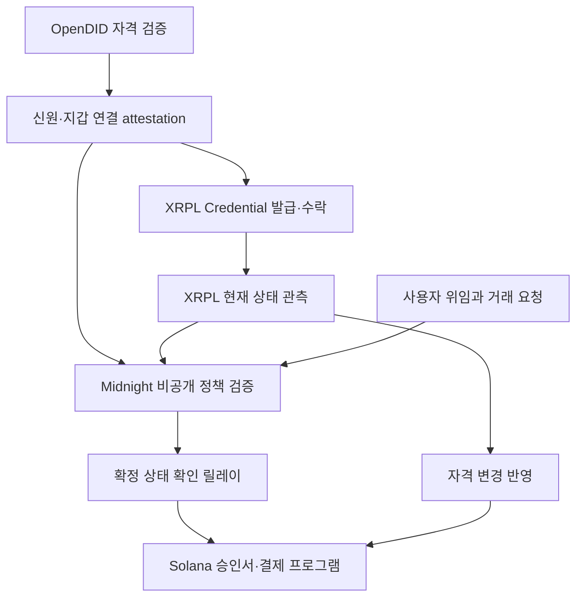

# ProofPass v2 — 신원 자격을 실제 거래 권한으로 연결하기

작성일: 2026-09-20

> 2026-09-21 후속 검토: 이 문서는 구현 전 설계 기록이다. 현재 문제 정의와 기존 기술 비교는 [README](README.md)와 [포지셔닝 검토](docs/POSITIONING.md)를 기준으로 한다. T54·AP2·Verifiable Intent·Privado ID와 겹치는 기능을 인정하고, 현재 기여를 외부 자격 변경과 목적지 지급을 연결한 참조 구현 및 테스트넷 검증 자료로 한정한다. 아래 차별화·고객 가설은 검증된 시장 우위를 뜻하지 않는다.

상태: 공식 문서에 근거한 제품·기술 설계. 이 문서 작성 과정에서 프로그램을 구현·배포하거나 테스트넷 거래를 실행한 것은 아니다. 아래 성공 조건과 성능 수치는 구현 목표이며 실측 결과가 아니다.

## 1. 핵심 결정

**ProofPass는 사용자의 기존 신원증명과 서비스 이용 자격을 확인하고, 사용자가 허용한 범위 안에서 에이전트가 다른 체인의 거래를 실행하도록 연결하는 시스템이다.**

초안의 ‘정책 결과를 여러 체인에서 소비한다’는 방향은 유지한다. 다만 실제 연결을 입증하려면 XRPL과 Solana에 각각 초록색 PASS를 표시하는 데서 끝나면 안 된다.

이번 권장 데모의 인과관계는 다음과 같다.

1. OpenDID로 테스트 이용자의 자격을 실제 검증한다.
2. 그 결과를 근거로 XRPL Testnet에 서비스 이용 자격 Credential을 발급하고 이용자가 수락한다.
3. 이용자가 Solana에서 에이전트에게 특정 수신자·기간·거래당 한도를 정해 위임한다.
4. Midnight가 OpenDID 검증 결과, XRPL 자격의 관측 상태, 이용자 위임과 거래 요청을 결합해 검증한다.
5. 검증된 거래 요청만 Solana Devnet 프로그램이 받아 테스트 자금을 실제 지급한다.
6. XRPL 자격 삭제 후 상태가 반영되면 새로운 Solana 거래가 거절된다. 이미 실행한 요청을 다시 제출해도 지급되지 않는다.

**재사용하는 것은 신원 근거와 정책이다. 거래 승인서는 거래별로 새로 만들고 한 번만 사용한다.**

이 설계는 세 시스템의 양방향 범용 브리지가 아니다. OpenDID의 근거가 XRPL 자격으로 반영되고, 그 자격 상태가 Solana의 특정 결제 경로에 영향을 주는 단방향 연결을 우선 완성한다. Midnight는 그 사이의 비공개 정책 검증을 담당한다.

## 2. 문제 정의: 무엇이 실제로 안 되는가

### 2.1 초안에서 약했던 주장

‘체인이 바뀌면 KYC를 반드시 다시 한다’는 설명은 너무 강하다. VC는 발급자·보유자·검증자 사이에서 증명서를 제시하는 구조이며, 체인 변경 자체가 재확인의 필수 원인은 아니다. 실제로는 수신 서비스가 어떤 발급자, 증명 형식, 확인 수준과 유효상태를 받아들이는지가 중요하다. [W3C VC Data Model 2.0](https://www.w3.org/TR/vc-data-model-2.0/)

‘각 체인의 증명 형식이 다르다’도 현상의 일부다. 형식만 변환해도 다음 질문은 남는다.

| 미해결 질문 | 단순 변환으로 해결되지 않는 이유 |
|---|---|
| 이 발급자를 우리 서비스가 믿어도 되는가? | 수신 서비스의 발급자 신뢰 설정이 필요하다. |
| 이 자격이 우리 서비스의 요구와 같은 뜻인가? | 성인·회원·실명확인·투자자 자격은 서로 다른 주장이다. |
| 지금도 유효한가? | 과거 발급 사실과 현재 삭제·만료·정지 여부는 다르다. |
| XRPL 지갑과 Solana 지갑을 같은 이용자가 통제하는가? | 주소 두 개를 적는 것은 통제권의 증거가 아니다. |
| 이용자가 이 에이전트의 이 거래를 허용했는가? | 신원 확인과 지출 위임은 서로 다른 권한이다. |
| API가 허용한 거래가 실제 체인에서도 제한되는가? | 화면을 건너뛰어 직접 호출할 수 있다면 정책이 강제되지 않는다. |

### 2.2 권장 문제 정의

> 사용자가 이미 검증 가능한 신원증명을 보유하고 서비스 이용 자격을 얻었더라도, 다른 체인의 서비스가 이를 현재 유효한 자격과 특정 거래의 실행 권한으로 받아들이려면 별도의 신뢰 설정, 지갑 연결, 상태 확인, 위임 검증과 실행 제어가 필요하다. 이 과정에서 사업자는 연동을 반복하고, 사용자는 불필요한 개인정보 제출이나 재승인을 요구받을 수 있다.

이는 공식 기술 문서에서 확인한 기능 경계를 바탕으로 정리한 제품 가설이다. 실제 발생 빈도, 비용, 고객의 지불 의사는 아직 검증하지 않았다. 학회에서 들은 빌더의 경험은 유력한 인터뷰 출발점이지만 시장 전체의 증거는 아니다.

### 2.3 누가 고객인가

첫 고객 가설은 **이미 이용자 자격을 관리하면서 두 개 이상의 체인에서 거래를 제공하는 결제·지갑·서비스 사업자**다. AI 에이전트는 사용 인터페이스이자 대리 실행자이며 그 자체가 구매 고객은 아니다.

가장 적합한 초기 상황은 다음 조건이 함께 있는 곳이다.

- 이미 인정하는 신원 발급자나 회원 자격이 있다.
- XRPL과 Solana를 실제로 함께 사용하거나 확장할 계획이 있다.
- 목적지 서비스가 해당 발급자와 자격의 의미를 받아들일 의사가 있다.
- 개인정보와 이용자의 전체 위임 한도를 목적지에 넘기고 싶지 않다.
- API의 판정이 아니라 실제 프로그램 실행까지 제한해야 한다.

예시 고객 시나리오: XRPL에서 회원 자격을 관리하는 서비스의 이용자가, 연계된 Solana 결제 기능을 에이전트에 맡긴다. 목적지 사업자는 합의된 발급자와 정책을 신뢰하고, 자격의 최신 관측 결과와 거래별 승인을 소비한다.

XRPL 자격을 실제로 쓰는 고객이 없다면 데모를 위해 XRPL 의존성을 억지로 추가할 이유도 약하다. 그 경우 OpenDID → Midnight → Solana만으로 먼저 제품 가치를 검증하는 것이 타당하다.

## 3. 정말 필요한가: 대안과 반증

| 대안 | 충분한 경우 | ProofPass가 더 제공해야 할 가치 |
|---|---|---|
| 중앙 서버 DB + 서명된 승인 API | 한 사업자가 모든 시스템을 운영하고 개인정보 처리도 수용 가능 | 비공개 입력으로 정책을 계산했다는 검증 가능성, 체인 실행 연결 |
| OpenDID VP/ZKP 직접 검증 | 성인 여부·자격 보유 여부 등 신원 조건만 필요 | 외부 자격의 현재 상태, 위임, 요청 거래의 결합 |
| 기존 프라이버시 신원 솔루션 | 지원되는 지갑·체인·자격 모델로 요구를 충족 | OpenDID·XRPL·Solana의 구체적 연동 비용을 줄이는지 입증 |
| 체인별 별도 allowlist | 계정 수가 적고 자격 변경이 드문 단일 운영 환경 | 변경·만료·위임 관리의 반복 작업 감소 |

Privado ID도 선택적 공개와 온체인·오프체인 검증을 제공한다. 따라서 ‘개인정보를 숨기는 최초의 다중체인 신원 서비스’라고 주장하지 않는다. 이번 차별화 가설은 **OpenDID의 근거, XRPL의 실제 자격 상태, 비공개 위임 정책과 Solana 실행을 하나의 검증 가능한 흐름으로 연결하는 통합**이다. 경쟁 제품보다 낫다는 결론은 동일 업무의 구현 비용과 동작을 비교한 뒤에만 낼 수 있다. [Privado ID 공식 문서](https://docs.privado.id/)

### Midnight가 필요한 경우와 필요 없는 경우

성인 여부를 증명하고 동일한 참·거짓을 다시 증명하는 것만 한다면 Midnight의 추가 가치는 작다. OpenDID에는 이미 조건 증명과 검증 기능이 있다.

Midnight의 역할은 여러 근거를 결합해 다음 명제를 검증하는 데 둔다.

> 신뢰된 기관이 확인한 자격을 가진 이용자가 현재 유효한 서비스 자격을 보유하고, 자신이 허용한 에이전트·수신자·기간·한도 안에서 이 거래를 요청했다.

공개할 값은 특정 거래의 요청 해시와 승인에 필요한 최소 메타데이터다. 원본 신원정보와 전체 위임 한도를 공개하지 않고 해당 정책 계산을 검증하는 것이 목표다.

그럼에도 입력 기관의 정직성과 목적지 릴레이는 신뢰해야 한다. 입력과 출력 모두 한 사업자를 전적으로 신뢰하는 환경이라면 중앙 API가 더 단순할 수 있다. Midnight는 그 사업적 조건까지 해결하지 않는다.

### 사업 필요성을 검증할 질문

최소 5개의 잠재 고객 인터뷰를 권장한다. 목표 수치이며 검증 결과가 아니다.

1. 최근 서로 다른 체인의 자격을 연동하다 막힌 구체적 거래가 있는가?
2. 재확인이 필요한 이유는 형식·발급자 신뢰·사업자 의무·최신 상태 중 무엇인가?
3. 기존 공급자 API를 붙이면 해결되는가? 해결되지 않는다면 무엇이 남는가?
4. 개인정보 없이 조건 결과만 받아도 실제로 서비스를 제공할 수 있는가?
5. XRPL 자격이 Solana 거래를 막거나 허용해야 하는 실제 업무가 있는가?
6. 에이전트 위임 한도를 목적지에 숨길 실질적 이유가 있는가?
7. 연동·운영 비용을 얼마나 쓰고 있으며 유료 파일럿을 할 의사가 있는가?

권장 진행 기준: 실제 장애 사례 3개, 기술 검증 파트너 2곳, 발급자 신뢰 및 자격 의미 합의에 참여할 곳 1곳. 고객들이 모두 ‘기존 KYC API로 충분하다’거나 ‘다른 사업자의 증명을 받아들일 수 없다’고 하면 범위를 축소한다.

초기 수익 가설은 사업자용 SDK·연동 구축비와 운영 구독료다. 거래량 기반 검증 과금은 처리 비용을 실측한 뒤 검토한다. 현재 가격·매출·시장 규모는 산정하지 않는다.

## 4. 공식 문서로 확인한 것과 아직 확인하지 않은 것

| 구성요소 | 확인한 기능 | 구현 전 확인해야 할 사항 |
|---|---|---|
| OpenDID | Verifier의 P311 ZKP 요청·검증 API, 서버 SDK의 `verifyProof` | 선택한 릴리스의 실제 빌드, 발급→보관→제시, 상태 확인, 세션 바인딩 |
| Midnight | 공식 ZK Loan 예제의 Jubjub Schnorr attestation 서명과 회로 내 검증 | 이 스키마의 인코딩·해시·서명 호환성, 안전한 시간 검증, 선택 네트워크 배포 |
| XRPL | Credential 발급·수락·만료·삭제, issuer/subject/type 구조 | 사용할 Testnet의 amendment, faucet, reserve, 실제 성공 영수증 |
| Solana | PDA·프로그램 기반 실행, Token-2022 Transfer Hook | Devnet 배포, 승인서 계정 검증, 지급 원자성, 직접 호출 우회 방지 |

OpenDID 문서에는 `POST /api/v1/request-proof-request-profile`과 `POST /api/v1/request-verify-proof`가 있으며, SDK에는 proof·nonce·요청·검증 파라미터를 받는 `ZkpProofManager.verifyProof(...)`가 있다. 이는 실제 연동의 출발점이지 우리가 발급·검증을 실행했다는 뜻은 아니다. 문서 예시의 생년월일 기준값은 복사하지 말고 정책 기준일에 맞게 계산해야 한다. [Verifier API](https://github.com/OmniOneID/did-verifier-server/blob/develop/docs/api/Verifier_API_ko.md), [ZKP SDK API](https://github.com/OmniOneID/did-zkp-sdk-server/blob/develop/docs/ZKP_SDK_SERVER_API.md)

Midnight ZK Loan의 패턴은 차용하되 샘플을 보안 감사를 통과한 제품으로 간주하지 않는다. 구현 시 공식 예제의 commit과 호환 툴체인을 고정한다. [공식 ZK Loan 예제](https://github.com/midnightntwrk/example-zkloan), [공식 문서 저장소](https://github.com/midnightntwrk/midnight-docs)

정부 모바일 신분증이 바로 연결된다는 주장은 하지 않는다. MVP는 **직접 운영하는 테스트 발급자가 OpenDID로 발급한 테스트 자격증명**을 쓴다. 실제 정부·금융기관의 발급과 동일한 신뢰 수준이 아니다.

## 5. 권장 아키텍처: 실제 의존관계가 있는 연결

첫 XRPL Credential은 OpenDID 검증 결과를 확인한 발급자가 발급한다. 이후 그 자격의 현재 상태와 거래 위임을 Midnight가 결합한다. 이 순서로 하면 ‘Midnight 결과가 있어야 XRPL 자격을 발급하고, XRPL 자격이 있어야 같은 Midnight 결과를 만든다’는 순환 의존성을 피한다.

### 역할과 신뢰 경계

| 역할 | 책임 | 신뢰해야 하는 부분 |
|---|---|---|
| 테스트 Identity Issuer | OpenDID 자격 발급 | 발급 내용이 사실이라는 주장 |
| Identity/Binding Adapter | OpenDID 결과 및 지갑 통제권 검증, 회로용 서명 | 잘못된 근거를 참이라고 서명하지 않을 것 |
| XRPL Issuer | 합의된 자격 의미를 Credential로 표현 | 자격 발급·회수 운영 |
| XRPL State Observer | validated ledger의 현재 상태를 관측하고 서명 | RPC 상태와 시간 정보를 정확히 전달할 것 |
| Mandate Adapter | 이용자 서명과 Solana 위임 등록을 확인하고 회로용 서명 | 이용자가 승인하지 않은 위임을 만들지 않을 것 |
| Midnight | 신뢰된 서명, 바인딩, 정책과 요청의 관계 검증 | 등록 키·정책 코드·증명 시스템의 정확성 |
| Destination Relay | 정확한 Midnight 확정 상태를 확인하고 Solana 승인서 생성 | 존재하지 않는 승인서를 만들지 않을 것 |
| Solana 프로그램 | 요청 일치·현재 위임·승인 만료·중복 사용 검증 후 지급 | 프로그램 및 업그레이드 권한의 안전성 |

MVP에서는 여러 역할을 한 운영자가 맡을 수 있으나 키와 로그는 분리한다. **Solana가 Midnight proof나 XRPL 합의를 직접 검증하는 구조는 아니다.** 기록된 해시와 트랜잭션 링크는 감사·재검증의 단서이지 그 자체로 trustless bridge가 아니다.

## 6. 기능을 두 종류로 분리한다

### A. 이용 자격: `SERVICE_ELIGIBILITY_V1`

목적: ‘이 계정이 특정 발급자의 서비스 자격 조건을 충족했다’는 상태.

- OpenDID의 신뢰된 테스트 발급자 및 고정 자격 스키마 확인.
- 예시 조건으로 만 19세 이상을 사용하되, 모든 결제에 연령 검증이 필요하다고 주장하지 않는다.
- XRPL CredentialType: `PROOFPASS_ELIGIBLE_V1`의 UTF-8 → hex.
- 만료: 데모 기본 1시간, 원본 근거의 유효기간을 넘지 않음.
- 누구에게나 적용되는 ‘KYC 완료’나 영구 자격으로 표현하지 않음.

### B. 일회 거래 승인: `AGENT_PAYMENT_AUTH_V1`

목적: ‘이 에이전트가 이 서비스의 이 자금에서 이 수신자에게 이 금액을 한 번 지급할 수 있다’는 요청별 권한.

필수 조건:

1. Identity/Binding Adapter의 서명과 정책 스키마가 유효하다.
2. XRPL 자격의 issuer·subject·type이 합의와 일치하고 accepted이며 관측 당시 미삭제·미만료다.
3. 동일한 비공개 주체 바인딩이 신원·XRPL 상태·위임에 사용되었다.
4. 이용자가 등록한 위임의 commitment·epoch와 회로 입력이 일치한다.
5. 에이전트·체인·프로그램·자금 계정·수신자·자산이 위임 범위와 일치한다.
6. 요청 금액이 거래당 한도 이하다.
7. 거래 승인 만료가 신원 근거·XRPL 자격·위임의 만료를 넘지 않는다.
8. 목적지에서 승인서의 정확한 요청 해시를 확인하고 한 번만 소비한다.

거래당 한도와 기간 누적 한도를 혼동하지 않는다. MVP는 **거래당 한도**만 검증한다. 여러 번의 소액 거래를 합쳐 한도를 넘기는 일을 막는 일·월 누적 예산이나 여러 체인에 걸친 공통 예산은 별도 상태 관리가 필요하므로 제외한다.

## 7. 신원·지갑·에이전트를 어떻게 연결하는가

초안의 `hash(publicIdentifier)`는 단독으로 통제권을 증명하지 못한다. `OpenDID Holder Secret`을 밖으로 꺼내 임의로 사용하는 것도 전제하지 않는다.

MVP 연결 절차:

1. Adapter가 일회용 `sessionId`, `challenge`, `audience`, 만료와 연결할 네트워크·주소를 생성한다.
2. Holder가 같은 세션에 결합된 OpenDID presentation을 제시한다. presentation challenge가 연결 요청 transcript를 참조하도록 지원 여부를 확인한다.
3. XRPL 이용자와 Solana 이용자가 동일한 연결 transcript에 각자 통제하는 키로 서명한다.
4. Adapter가 실제 XRPL 계정의 서명 권한을 확인한다. MVP는 새 테스트 계정의 master key 경로로 제한하고 regular key·다중서명 지원을 가장하지 않는다.
5. Solana 지갑 서명을 해당 public key로 검증한다.
6. 같은 세션의 세 증거를 검증한 뒤 Adapter가 `BindingAttestation`을 서명한다. challenge는 소모 처리한다.

ZKP의 숨은 holder secret을 직접 추출하거나 서로 다른 proof의 동일 보유자 관계를 자동으로 보장한다고 가정하지 않는다. 지원되는 presentation 바인딩과 세션 연계를 구현·시험해야 한다. 이 방식이 증명하는 것은 한 인증 세션에서의 자격 제시와 지갑 통제다. 자발적 자격 대여나 키 공유까지 막는 것은 아니다.

외부 공개용 식별자는 서비스·목적지마다 분리하고 충분한 무작위 salt를 둔다. 이름·생년월일·DID 문자열의 단순 해시는 개인정보 보호 수단으로 삼지 않는다. XRPL 주소, Solana 주소, 공통 receipt ID를 모두 온체인에 함께 기록하지 않는다.

## 8. 구현 인터페이스

아래는 신규 설계 스키마다. OpenDID나 Midnight가 그대로 제공하는 API로 오해하면 안 된다. 실제 서명 대상은 임의 JSON 문자열이 아니라 필드 순서·길이·정수 범위가 고정된 버전형 인코딩이다.

| 객체 | 필수 필드 |
|---|---|
| `BindingAttestation` | version, providerKeyId, sessionId, privateSubjectCommitment, xrplNetwork, xrplAccount, solanaCluster, solanaOwner, holderSessionDigest, issuedAt, expiresAt, signature |
| `IdentityAttestation` | version, providerKeyId, privateSubjectCommitment, issuerPolicyId, schemaVersion, eligibilityPredicate, verificationMode, checkedAt, expiresAt, signature |
| `XrplStateAttestation` | version, observerKeyId, privateSubjectCommitment, issuer, subject, credentialType, credentialId, status, ledgerIndex, ledgerHash, ledgerCloseTime, observedAt, validUntil, sourceEpoch, signature |
| `MandateAttestation` | version, mandateProviderKeyId, privateSubjectCommitment, solanaOwner, agentKey, destinationCluster, programId, vault, allowedRecipient, assetId, maxPerTx, mandateCommitment, mandateEpoch, notBefore, expiresAt, signature |
| `PaymentRequest` | version, policyId, policyVersion, destinationCluster, programId, owner, agentKey, vault, recipient, assetId, amountBaseUnits, requestId, mandateEpoch, expiresAt |
| `ExecutionReceipt` | version, requestHash, destinationCluster, programId, receiptId, policyId, policyVersion, mandateCommitment, mandateEpoch, sourceStatusHandle, sourceEpoch, expiresAt, midnightNetwork, midnightContract, midnightTxRef |

`verificationMode`는 `opendid-zkp` 또는 `opendid-vp`로 구분한다. 일반 VP를 사용하면 Verifier가 공개된 claim을 보았을 수 있으므로 ‘Verifier에게도 원본 정보가 비공개’라고 주장하지 않는다.

### 회로와 목적지가 같은 요청을 읽게 만들기

- 공통 domain separator 예: `PROOFPASS:AGENT_PAYMENT_AUTH:V1`.
- 금액은 부동소수점 대신 최소 단위 정수. SOL 데모는 lamports만 사용한다.
- 네트워크·프로그램·vault·수신자·자산·금액·requestId·만료·위임 epoch를 모두 요청에 바인딩한다.
- Compact와 Solana에서 지원되는 공통 해시를 먼저 확인한다. 지원 확인 없이 SHA-256이나 Poseidon을 회로에 쓸 수 있다고 단정하지 않는다.
- 공통 해시가 곤란하면 canonical request를 Compact가 지원하는 방식으로 commitment하고 릴레이가 정확한 요청과 비교하는 매핑을 구현한다. 이 변환은 릴레이 신뢰 경계에 포함한다.
- 같은 입력과 한 필드가 바뀐 입력에 대한 언어 간 테스트 벡터를 만든다.

### 제안 서비스 경로

| 경로 | 역할 |
|---|---|
| `POST /bindings/challenge` | 연결 요청 발급 |
| `POST /bindings/complete` | presentation 및 지갑 서명 검증 |
| `POST /xrpl/credentials` | 검증된 근거로 발급 요청, 거래 참조 반환 |
| `POST /authorizations` | PaymentRequest별 Midnight 정책 실행 요청 |
| `GET /authorizations/:requestId` | 실제 처리 단계와 증거 참조 조회 |
| `POST /solana/execute` | 승인된 요청을 제출하는 편의 경로; 최종 제어는 프로그램이 수행 |

브라우저가 보내는 `verified=true`나 `authorized=true`를 근거로 삼지 않는다. 신뢰된 Verifier 결과와 실제 chain 상태를 서버에서 확인한다.

## 9. Midnight 설계

단일 `AGENT_PAYMENT_AUTH_V1` 회로에 집중한다. OpenDID proof를 Compact 안에서 재귀 검증하지 않고 검증 Adapter의 서명을 검증한다.

### 비공개 입력

- 신원·연결·XRPL 상태·위임 attestation의 필드와 서명.
- 이용자의 거래당 한도, 위임 상세 조건, commitment의 무작위 salt.
- 공개 출력과 연결되는 PaymentRequest preimage.

### 공개 상태·출력

- 역할별 신뢰 키, 허용 정책 버전.
- 요청 commitment, 승인 만료, 목적지 식별에 필요한 최소 정보.
- 선택적으로 회로 승인 요청의 중복 방지 집합. 목적지 소비 방지는 별도로 필수.

### 실제로 검증할 것

서명 유효성만 확인해서는 부족하다. 각 서명 payload의 주체 commitment와 정확한 요청, 정책 버전, 목적지가 모두 일치해야 한다. `agentMandateActive=true`를 이용자가 witness로 보내는 것만으로 위임을 인정해서는 안 된다.

MVP에서는 이용자가 Solana에 `mandateCommitment`·agent·epoch를 직접 서명해 등록하고, Mandate Adapter가 등록과 상세 위임의 일치를 확인한 후 Compact 호환 서명으로 재증명한다. 이용자의 원래 지갑 서명을 Compact가 직접 검증한다고 주장하지 않는다. 목적지 프로그램은 최종 지급 시 현재 위임 계정과 commitment·epoch를 다시 대조한다.

**시간도 검증 입력이다.** 이용자가 선택한 `now`를 private witness로 넣고 만료를 검증하지 않는다. 고정한 Compact 버전의 검증 가능한 시간/거래 유효성 기능을 확인하고, 지원이 부족하면 신뢰된 시간 관측의 서명과 짧은 승인 TTL을 사용한다. 어느 경우든 Solana는 실행 시 자체 Clock으로 승인 만료와 최신 관측의 유효기간을 검사한다.

만료·거짓 조건으로 회로가 assert에 실패하면 유효한 승인 proof가 생성되지 않을 수 있다. 이때 UI는 ‘승인 생성 실패’와 원인을 표시한다. 이것을 온체인에 확정된 `FAIL proof`로 포장하지 않는다.

원본 witness가 원격 proof server나 운영자 프로세스에 전달되는지도 확인한다. 기본 개발 흐름은 이용자 통제 로컬 prover를 우선하고, 서버에서 처리한다면 그 서버는 비공개 입력을 볼 수 있는 신뢰 경계로 표시한다.

## 10. XRPL: 발급·수락·상태·삭제를 모두 실제로

MVP 필수 거래는 `CredentialCreate`, `CredentialAccept`, `CredentialDelete`다. 발급자와 주체는 서로 다른 테스트 계정으로 둔다.

- `CredentialType`은 서비스 자격 의미만 표현하고 거래별 금액·수신자 권한으로 사용하지 않는다.
- Expiration은 Ripple epoch 기준으로 변환하고 원본 근거의 만료를 넘지 않는다.
- 발급 tx 성공, 이용자의 accept tx 성공, validated ledger에서 accepted 상태를 각각 확인한다.
- 동일 issuer·subject·type 자격 중복 발급을 처리하고 재시도를 idempotent하게 만든다.
- URI·Memo에 이름, 생년월일, OpenDID ID, Solana 지갑이나 전체 attestation을 넣지 않는다.
- Credential만 발급한다고 모든 XRP 송금에 정책이 적용되는 것은 아니다.

이 수명주기와 필드 제한은 XRPL 공식 문서에 근거한다. [Credentials](https://xrpl.org/docs/concepts/decentralized-storage/credentials), [CredentialCreate](https://xrpl.org/docs/references/protocol/transactions/types/credentialcreate), [CredentialDelete](https://xrpl.org/docs/references/protocol/transactions/types/credentialdelete)

### State Observer

매 승인 요청마다 fresh validated ledger를 조회한다. 과거 `CredentialCreate` 영수증만 검사하지 않는다. issuer·subject·type, accepted, expiration, 현재 존재 여부를 확인한다.

상태 attestation에는 ledger index/hash·관측 시각·짧은 유효기간을 포함한다. 조회 오류와 자격 부재를 구분하되 둘 다 신규 승인을 발급하지 않는다. 오래된 관측으로 갱신하지 않으며 서로 모순되는 RPC 결과도 허용으로 처리하지 않는다.

강화 기능으로 XRPL Deposit Authorization을 이용한 실제 XRP 수신 허용·거절도 가능하다. 단, 단순 Credential 발급과 별도의 설정이 필요하고 계정별 사전 허용 같은 우회 경로를 검토해야 한다. 이는 핵심 Solana 지급 경로가 끝난 뒤 추가한다. [Deposit Authorization](https://xrpl.org/docs/concepts/accounts/depositauth)

## 11. Solana: API 응답을 넘어 실제 실행까지

### 권장 P0: Anchor 결제 프로그램 + 프로그램 소유 vault

첫 데모는 Devnet SOL을 사용한다. 테스트 mint·USDC·환율을 도입하지 않고 0.05 SOL 지급으로 실제 자금 이동을 확인한다. 실사용 금전 결제가 아니다.

프로그램 계정:

| 계정 | 핵심 내용 |
|---|---|
| `Config` PDA | 신뢰 릴레이, 정책 버전, 관리자 권한 |
| `Mandate` PDA | owner, agent, commitment, epoch, 활성 상태, 만료 |
| `Vault` PDA | 테스트 자금 보관, owner와 mandate 연결 |
| `SourceStatus` PDA | 목적지별 불투명 handle, source epoch, active, 관측 유효기간 |
| `Authorization` PDA | 요청 해시, 정책, mandate/source epoch, 만료, consumed |

주요 instruction:

- `initialize_mandate`: 이용자 서명으로 위임 commitment와 agent 등록.
- `fund_vault`: 이용자의 테스트 자금 예치.
- `update_source_status`: 허용된 observer/relay만 최신 source epoch 기록.
- `record_authorization`: 허용된 릴레이가 Midnight 결과 확인 후 정확한 요청의 승인서 기록.
- `execute_payment`: agent 서명, 계정 소유자·PDA seeds·정책·현재 epoch·Clock·requestHash를 확인하고 consumed 처리와 지급을 한 트랜잭션에서 수행.
- `revoke_mandate`: 이용자 서명으로 epoch를 올리거나 비활성화하여 기존 승인을 차단.

프로그램 소유 vault의 lamports를 옮길 때는 Solana 계정 소유 규칙에 맞는 잔액 변경을 사용하고 rent에 필요한 잔액을 유지한다. System Program 소유 PDA를 쓴다면 별도 CPI/invoke_signed 경로가 필요하므로 두 소유 모델을 혼합하지 않는다. PDA는 주소일 뿐 실행 권한을 자동 보장하지 않는다. [Solana PDA](https://solana.com/docs/core/pda), [Solana CPI](https://solana.com/docs/core/cpi)

공격자가 API를 거치지 않고 `execute_payment`를 직접 호출해도 같은 검사를 통과해야 한다. 성공 시 vault·수신자 잔액 변화와 transaction signature를 증거로 남긴다. 같은 `requestId`를 다시 실행하면 두 번째 지급은 실패한다. 소비 계정을 삭제하고 같은 승인서를 재생성할 수 없도록 재초기화를 차단한다.

이 프로그램이 통제하는 것은 해당 vault의 에이전트 지급 경로다. 이용자 자신의 다른 지갑 송금, 다른 프로그램이나 Solana 전체를 통제한다고 주장하지 않는다. 이용자의 명시적 자금 회수 경로는 에이전트 결제와 별도로 정의한다.

### P1: Token-2022 Transfer Hook

추가 시간이 있으면 직접 만든 테스트 토큰의 mint에 Transfer Hook을 설정하고 자격 PDA를 검사한다. 이 경우 특정 앱을 건너뛰는 직접 토큰 전송도 hook 검사를 거쳐야 한다. 다만 기본 전송 계정은 hook에서 read-only이고 원래 signer 권한이 그대로 전달되지 않으므로, 별도 계정과 위임 설계가 필요하다. [Solana Transfer Hook](https://solana.com/docs/tokens/extensions/transfer-hook)

기존 SOL이나 임의의 USDC에 우리가 hook을 붙일 수 있다고 가정하지 않는다. Hook이 HTTP로 OpenDID·Midnight API를 호출한다고 설계하지 않는다. **P0 결제 프로그램과 P1 Transfer Hook을 동시에 완성하려 하지 않는다.**

## 12. 취소와 최신 상태: 가장 중요한 제한

XRPL에서 삭제했다고 Solana 상태가 같은 순간 바뀌지는 않는다. source 상태를 관측·전달·확정하는 지연과 이미 발급된 승인서의 유효기간이 남는다.

MVP 정책:

- 매 신규 승인 때 XRPL 상태를 다시 확인한다.
- 실행 승인서 TTL은 60초를 초기 목표로 하되 실제 proof 생성·확정 시간을 보고 조정한다.
- 상태 관측 lease도 짧게 두고 마지막 갱신 이후 만료되면 Solana에서 차단한다.
- 삭제 관측 후 `SourceStatus.active=false`, `sourceEpoch` 증가를 Solana에 반영한다.
- 기존 승인서는 이전 source epoch를 참조하므로 반영 완료 후 사용할 수 없다.
- 삭제된 자격을 재발급해도 이전 승인서가 살아나지 않도록 epoch를 단조 증가시킨다.
- 위임 취소는 Solana의 현행 mandate epoch를 실행 시 직접 확인한다.

데모는 ‘XRPL 삭제 확정 → 관측 → Solana 상태 반영 확정 → 신규 요청 및 남은 승인 사용 거절’을 보여준다. **즉시·원자적 크로스체인 취소라고 표현하지 않는다.**

정직한 observer/relay와 유효한 clock 가정에서, 기존 승인은 TTL/관측 lease의 만료 또는 epoch 갱신으로 제한된다. 실제 노출 구간은 측정해 공개한다. 악의적 릴레이가 거짓 상태·승인을 계속 만들 수 있는 위험은 TTL만으로 해결되지 않는다.

## 13. 개인정보 보호를 정확히 설명한다

| 정보 | 누가 볼 수 있는가 |
|---|---|
| 이름·생년월일 등 원본 | 테스트 발급자와 holder. 일반 VP fallback이면 Verifier도 일부 확인 가능 |
| OpenDID와 두 지갑의 연결 | Binding Adapter가 알 수 있음 |
| 위임의 전체 한도·세부 조건 | 이용자와 위임 처리 주체·prover 구성에 따라 노출 가능 |
| XRPL 자격 보유 및 issuer/subject | XRPL의 공개 관측자 |
| Solana 결제 금액·수신자·시점 | Solana의 공개 관측자 |
| 승인·자격 갱신 시점과 상관관계 | 공개 체인의 관측자가 일부 추론 가능 |

따라서 ‘개인정보가 전혀 없다’·‘아무것도 공개되지 않는다’·‘체인 간 추적이 불가능하다’는 표현을 쓰지 않는다. 정확한 목표는 **원본 신원정보와 전체 위임 조건을 목적지 체인에 공개하지 않고 거래 조건 충족을 확인하는 것**이다.

## 14. 3분 데모

| 시간 | 장면 | 반드시 보여줄 증거 |
|---|---|---|
| 0:00–0:20 | 자격은 있지만 다른 체인의 거래 권한으로 바로 연결되지 않는 상황 | 기존 자격·목적지 거래 요청의 차이 |
| 0:20–0:45 | OpenDID 테스트 자격 제시와 실제 검증 | 검증 세션, 사용한 모드, issuer 정책 |
| 0:45–1:10 | XRPL Credential 발급·수락 | validated create/accept tx와 실제 ledger 객체 |
| 1:10–1:50 | 에이전트의 0.05 SOL 요청 승인·지급 | Midnight 승인 상태, Solana tx와 잔액 변화 |
| 1:50–2:10 | 같은 승인서 재사용 | consumed 상태와 추가 지급 없음 |
| 2:10–2:35 | 0.10 SOL 거래당 한도에 0.15 SOL 요청 | 승인 생성 거절, 지급 없음 |
| 2:35–3:00 | XRPL 자격 삭제·반영 후 재요청 | delete tx, status epoch 변경, 신규 승인 거절 |

사용자 화면에서만 위임 한도를 보여주고 공개 explorer에는 쓰지 않는다. 에이전트는 간단한 CLI여도 충분하다. LLM의 자율 판단이나 대화 UI는 성공 조건이 아니다.

체인 확정과 proof 생성이 3분을 넘으면 기다림을 편집한 영상과 편집 없는 로그를 함께 제공한다. 사전 생성 데이터를 실시간 결과처럼 표시하지 않는다. 필요한 거절 케이스는 별도 증거 화면으로 함께 준비한다.

핵심 발표 문장:

> 사용자가 이미 가진 자격을 다른 체인의 거래에 연결할 때 필요한 것은 증명서 복사만이 아닙니다. 지금도 유효한 자격인지, 같은 이용자의 지갑인지, 이 에이전트에게 이 거래를 맡겼는지까지 확인해야 합니다. ProofPass는 이 조건들을 비공개로 검증하고, 실제 결제 프로그램이 그 결과를 따르도록 연결합니다.

## 15. 반드시 통과해야 할 테스트

| 테스트 | 기대 결과 |
|---|---|
| 정상 OpenDID presentation | 고정 issuer·schema·nonce 검증 후 attestation |
| 위조 proof·잘못된 nonce·허용되지 않은 issuer | attestation 생성 거절 |
| 다른 이용자의 Solana 주소로 치환 | binding 또는 요청 일치 검사 실패 |
| attestation 서명·한도·수신자 변조 | Midnight 승인 생성 실패 |
| 사용자 위임 없이 `active=true` 삽입 | 위임 commitment·서명 검증 실패 |
| XRPL 발급 후 미수락 | 승인 거절 |
| 다른 issuer/type의 XRPL 자격 | 승인 거절 |
| 만료·삭제 자격 | 신규 승인 거절 |
| 오래된 RPC 상태·관측 lease 만료 | 신규 승인 및 목적지 실행 차단 |
| 목적지 program·cluster·asset·recipient·amount 변경 | requestHash 또는 필드 검증 실패 |
| 승인서 없이 직접 프로그램 호출 | 지급 실패 |
| 동일 승인서 재시도·동시 제출 | 최대 한 번 지급 |
| 다른 agent 서명 | 지급 실패 |
| mandate 취소·epoch 변경 | 기존 승인 지급 실패 |
| source 취소 반영·epoch 변경 | 기존 승인 지급 실패 |
| 지급 과정 실패 | consumed만 남거나 일부 지급되는 비원자적 상태 없음 |

회로에서 승인 생성이 실패한 경우, RPC simulation만 실패한 경우, 실제 제출되어 실패한 거래를 증거에서 구분한다. 네트워크 수수료와 rent 변화는 지급액 검증과 분리한다.

## 16. 구현 순서와 중단 기준

공식 행사 페이지는 제출일을 2026년 9월 27일로 안내한다. 정확한 마감 시각·시간대와 제출물은 행사 Hub에서 추가 확인해야 한다. 이 문서에서는 그 상세 규칙을 확인하지 못했다. [행사 안내](https://luma.com/2pnv2fwk)

### Gate 0 — 첫날 도구와 연결 위험 제거

- OpenDID 선택 버전·의존 서비스를 고정하고 실제 발급→검증 샘플 1개 실행.
- Midnight 공식 예제를 고정 commit으로 컴파일하고 정상/잘못된 서명 검증.
- XRPL 테스트 계정에서 create→accept→delete 실행.
- Solana Devnet에서 프로그램 배포와 소액 테스트 지급 확인.

이 결과를 얻기 전에는 아름다운 UI나 여러 정책을 만들지 않는다.

### Gate 1 — 가장 얇은 실제 경로

OpenDID 실제 검증 → XRPL 발급·수락 → 상태 attestation → Midnight 한 거래 승인 → relay → Solana 승인서 기록·지급.

이 단계에서는 테스트 fixture를 쓸 수 있지만 공개 데모의 외부 입력 경로에는 mock을 남기지 않는다.

### Gate 2 — 실패 경로와 신뢰 경계

지갑 치환, 미수락 자격, 금액 초과, 승인 재사용, 자격 삭제, 위임 취소, 만료와 RPC 장애를 구현한다. replay·binding·expiry는 초안의 P1에서 **P0**으로 올린다.

### Gate 3 — 화면과 증거

단일 화면에서 Identity / XRPL status / Midnight authorization / Solana payment 상태를 구분한다. 네트워크와 계약 주소, 실제 거래 링크, 마지막 상태 관측 시각을 표시한다. 오류는 ‘자격 없음’과 ‘상태 확인 불가’를 구분한다.

### 권장 일정 배분

| 구간 | 결과물 |
|---|---|
| 9/20–9/21 | Gate 0, 정책·인코딩·키 역할 확정 |
| 9/22–9/23 | Gate 1, CLI로 정상 지급 경로 |
| 9/24 | Gate 2, 취소·재사용·변조 차단 |
| 9/25 | Gate 3, 화면·실측·증거 정리 |
| 9/26 | 제출 버전 동결·녹화·문서 |
| 9/27 | 버퍼 및 제출. 정확한 마감 확인 필요 |

개발자 수와 숙련도를 가정한 보장 일정이 아니다. 첫날 결과에 따라 축소한다.

### 축소 순서

1. Transfer Hook, XRPL Deposit Authorization, 다중 issuer, 실제 LLM 연동부터 제외.
2. 모바일 UI가 막히면 공식 OpenDID SDK 기반 실제 암호 검증 CLI로 축소하고 ‘모바일 앱 전체 통합’ 표현을 제거.
3. OpenDID ZKP가 막히면 실제 VP 검증으로 축소하되 Verifier의 정보 노출 범위를 수정.
4. OpenDID 자체가 mock으로 남으면 ‘OpenDID 실제 연동 완료’라 주장하지 않음.
5. Solana API만 남으면 ‘온체인 실행 데모 완료’가 아님.
6. Midnight가 로컬에서만 실행되면 이를 명시하고 퍼블릭 네트워크 검증이라고 쓰지 않음. 행사 요건 충족 여부 별도 확인.

## 17. 완료 정의와 증거 꾸러미

‘실제 연결’ 완료는 아래가 모두 충족된 경우다.

- 실제 OpenDID SDK/Verifier가 테스트 발급자의 presentation을 검증했다.
- 실제 XRPL Testnet create·accept·delete 거래 및 상태가 존재한다.
- Midnight 회로가 외부 서명을 검증하고 요청에 바인딩된 승인을 생성했다.
- 실제 Solana Devnet 프로그램이 승인서에 따라 테스트 자금을 지급했다.
- source 자격 부재·삭제·미수락이 새로운 목적지 승인에 영향을 준다.
- 허용·거절·취소·재사용 테스트와 신뢰 경계가 공개되어 있다.

재현 자료는 `evidence/demo-run.json`에 네트워크, 코드 commit, 계약 주소, 비민감 요청 식별자, 거래 참조, 상태 관측 및 반영 시각, 실행 결과를 남긴다. 이 파일은 **구현 시 생성할 산출물**이며 지금 존재하는 실행 증거가 아니다. seed·개인키·원본 VC·private witness는 포함하지 않는다.

실측 지표: OpenDID 검증 시간, proof 생성 시간, 네트워크 확정 시간, 총 승인→지급 시간, 자격 삭제→목적지 차단 지연, 정상 지급 횟수, 중복 지급 횟수, 거절 이유. 비용·성능 개선은 측정 전 수치로 주장하지 않는다.

## 18. 개발 에이전트에 넘길 지시

이 문서는 구현 요구사항이다. 공식 API와 샘플의 현재 동작을 확인하고, 완료되지 않은 연결을 mock 성공으로 숨기지 말 것.

첫 작업은 네 구성요소의 Gate 0 결과를 확보하고 `COMPATIBILITY.md`에 commit·버전·실행 명령·실패 원인을 기록하는 것이다. 이후 아래 순서로 진행한다.

1. 공통 인코딩·요청 해시·키 역할·신뢰 발급자·정책 버전을 확정한다.
2. OpenDID presentation과 두 지갑의 session binding을 구현한다.
3. XRPL 자격 수명주기 및 현재 상태 observer를 구현한다.
4. 이용자 위임의 원본 승인과 회로용 attestation을 연결한다.
5. Midnight에서 서명·주체·목적지·정책·한도·기간·요청 일치를 검증한다.
6. relay가 고정된 Midnight 네트워크·계약·정책의 실제 확정 상태와 요청 commitment를 대조하도록 구현한다. 프런트엔드 PASS 문자열을 신뢰하지 않는다.
7. Solana 프로그램에서 승인 소비와 테스트 지급을 원자적으로 처리한다.
8. source 상태 및 mandate epoch로 취소를 반영한다.
9. 필수 실패 케이스를 검증하고 실제 evidence를 생성한다.
10. 마지막에 UI·발표 영상·README를 만든다.

금지할 주장: 정부 모바일 신분증 연동 완료, 금융 KYC 완전 대체, 전 체인에 동일 proof의 네이티브 검증, trustless bridge, 즉시 크로스체인 취소, 모든 SOL/USDC 전송 통제, 여러 체인의 공통 누적 한도, 완전한 비연결성.

권장 최종 제품 설명:

> ProofPass connects verified identity and live service eligibility to transaction-specific agent permissions across chains, keeping underlying identity data and full mandate limits off the destination ledger.

> ProofPass는 검증된 신원과 현재의 서비스 이용 자격을 체인별 거래 권한으로 연결합니다. 목적지 체인에는 원본 신원정보와 전체 위임 한도 대신, 해당 거래의 실행에 필요한 승인만 전달합니다.
