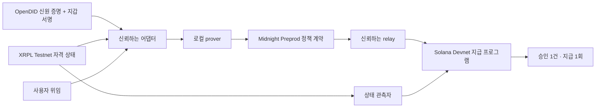
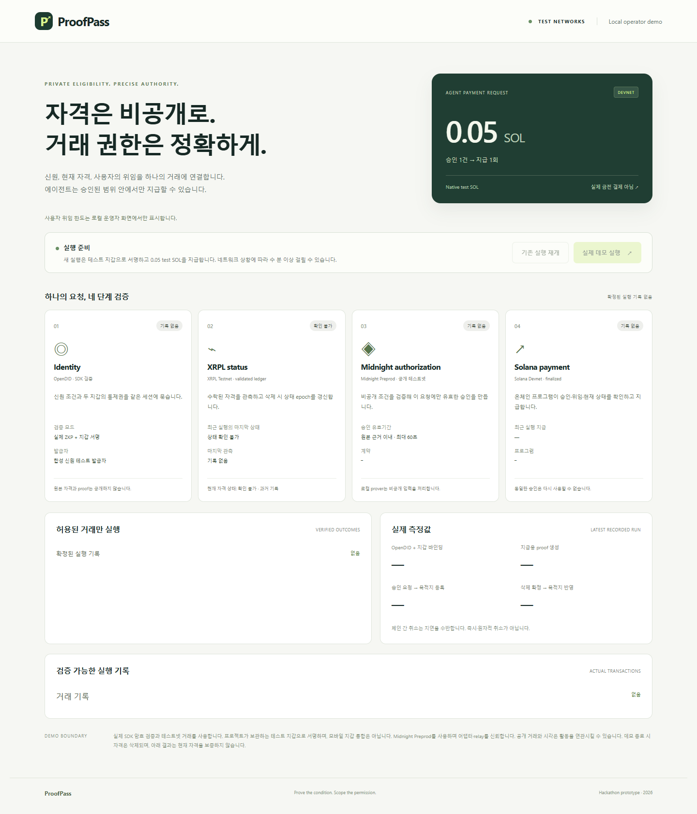

# ProofPass

**자격이 회수되면, 다른 체인의 미사용 지급 승인도 멈추도록.**

ProofPass는 **외부 서비스의 자격 변경을 에이전트의 실제 지급 조건에 연결하는 참조 구현**입니다. OpenDID 신원 근거와 XRPL 자격의 관측 상태, 비공개 위임 조건을 Midnight에서 결합하고, Solana 지급 프로그램에서 승인·위임·자격 상태를 대조합니다. 정상 지급뿐 아니라 **자격 삭제 후 기존 승인으로 지급을 시도했을 때의 거절**까지 테스트넷 거래로 검증했습니다.

**현재 단계: 해커톤용 기술 실증.** 동작하는 통합과 실행 증거를 제공하며, 고객 수요나 사업성을 검증한 상용 제품은 아닙니다.

## 문제 정의: 승인 이후 바뀐 자격을 지급에 어떻게 반영할까

회원 자격을 가진 사용자가 에이전트에게 결제를 맡겼습니다. 지급 승인을 받은 뒤, 실제 송금 전에 회원 자격이 회수됐습니다. **원래 승인의 만료 시간이 남아 있어도 지급을 막아야 하는 서비스라면, 지급처는 변경된 자격을 어떻게 확인해야 할까요?**

신원·자격을 관리하는 시스템과 지급 시스템이 다르면, 운영자는 다음을 연결해야 합니다.

| 필요한 연결 | ProofPass에서 확인하는 동작 |
|---|---|
| 신원 증명과 지급 지갑의 연결 | 같은 세션에서 OpenDID 증명과 두 체인의 지갑 통제권 확인 |
| 서비스 자격과 사용자의 지급 위임 | 현재 자격과 에이전트·수취인·기간·거래당 한도를 결합해 거래별 승인 생성 |
| 승인 이후의 자격 변경과 실제 지급 | 목적지에 반영된 자격 상태·버전을 다시 대조해 이전 승인 거절 |
| 상태 전달 지연과 재시도 | 상태 유효기간이 지나면 지급 중단, 소비한 승인 재사용 거절 |

이때 원본 신원정보와 전체 위임 한도를 공개 체인에 올리지 않는 것이 설계 조건입니다. **연결이 잘못되면 과거의 유효한 승인이 현재의 지급 권한처럼 사용될 수 있습니다.** 반대로 최신 근거가 부족할 때 중단하면 정상 거래도 지연될 수 있으므로, 이 데모는 차단 여부와 반영 시간을 함께 기록합니다.

이것은 기존 제품이 해결하지 못한다고 확인된 시장 공백이 아니라, **이 저장소가 구현하고 검증한 구체적인 연동 문제**입니다. 취소, 비공개 증명, 일회용 승인 각각의 발명을 주장하지 않습니다.

## 기존 기술과 무엇이 겹치고, 여기서는 무엇을 검증했나

2026-09-21 공식 자료 기준입니다. 제품·프로토콜의 역할이 서로 다르므로 기능 유무 점수표로 비교하지 않습니다.

| 기존 기술 | 이미 다루는 영역 | ProofPass와의 관계 |
|---|---|---|
| [T54 Trustline](https://docs.t54.ai/docs/trustline/overview) | 에이전트 거래의 위임·정책·위험 판단과 감사 근거 | 에이전트 지급 통제라는 큰 문제는 겹칩니다. 이 데모는 위험 평가 엔진을 구현하지 않습니다. |
| [AP2](https://ap2-protocol.org/ap2/agent_authorization/) / [Verifiable Intent](https://www.verifiableintent.dev/spec/) | 사용자와 에이전트의 권한 연결, 지급 위임; VI는 선택적 공개도 정의 | 위임과 개인정보 최소 공개는 새로운 개념이 아닙니다. 현재 데모는 자체 위임 형식이며 두 규격과의 호환성을 검증하지 않았습니다. |
| [Privado ID](https://docs.privado.id/docs/verifier/on-chain-verification/cross-chain/) | ZK 자격 증명과 다른 체인의 사용자·발급자 상태를 이용한 온체인 검증 | 비공개 크로스체인 자격 검증 자체도 이미 있습니다. 특정 체인 조합만으로 제품 우위를 주장하지 않습니다. |
| [XRPL Credentials](https://xrpl.org/docs/concepts/decentralized-storage/credentials) | 자격 발급·수락·삭제, 자격을 사용하는 접근 제어 | 이 데모는 기존 자격 기능을 사용하고 그 관측 상태를 Solana 지급 경로에 연결합니다. |

**이 저장소의 기여는 OpenDID → XRPL → Midnight → Solana의 실제 연동과, 지급·취소·자격 삭제·재사용 거절을 확인할 수 있는 실행 기록입니다.** 기존 서비스보다 안전하거나 저렴하다는 비교 결과, 최초 구현이라는 근거는 없습니다. T54·AP2·Privado ID와 실제 연동한 것도 아닙니다. [비교 검토와 제품 검증 기준](docs/POSITIONING.md)에 근거와 남은 질문을 정리했습니다.

## 사용 예시: 회원 자격이 바뀌는 위임 결제

다음은 제품 가설을 설명하는 시나리오이며, 실제 고객 도입 사례는 아닙니다.

1. 회원 자격을 XRPL에서 관리하는 서비스가 Solana 결제를 제공합니다. 사용자는 지정한 에이전트에게 정해진 수취인·기간 안에서 **거래당 최대 0.10 SOL** 지급을 맡깁니다.
2. 0.05 SOL 요청은 비공개 정책 검증을 거쳐 승인되고, 해당 프로그램의 vault에서 한 번 지급됩니다.
3. 다른 요청에 대한 승인이 아직 미사용 상태일 때 회원 자격을 삭제합니다. 삭제가 Solana의 관측 상태에 반영되면, 그 승인의 만료 전이라도 지급을 거절합니다.
4. 사용자가 위임을 취소한 경우에도 지급을 거절합니다. 상태 갱신이 끊겨 유효기간이 지나면 지급을 중단하고, 이미 소비한 승인은 다시 사용할 수 없습니다.

**자격 회수와 다른 체인의 차단은 동시가 아닙니다.** 관측·전달 지연 동안의 차이를 인정하며, 현재 구현은 신뢰하는 관측자와 최대 60초의 상태·승인 유효기간을 사용합니다.

## 누구에게 왜 필요한가

대상 가설은 **기존 신원·회원 자격 체계를 유지하면서, 다른 체인에서 자격 조건부 지급을 제공하려는 개발팀**입니다. 이 팀은 이 저장소를 통해 자격 삭제가 지급에 반영되는 경로와 신뢰 지점, 실패 시 동작, 실제 거래 기록을 살펴볼 수 있습니다. 사용자는 자신의 위임이 취소되거나 자격이 회수된 뒤 지급이 계속되지 않기를 기대합니다.

현재 가치는 **검토 가능한 참조 구현과 통합 검증 자료**입니다. 범용 SDK, 고객 도입, 연동 비용 절감은 아직 입증하지 않았습니다. 단일 운영자의 서버 정책으로 충분하거나 기존 제품의 연동으로 요구를 충족한다면 그 방법이 더 적합할 수 있습니다. 제품으로 발전시키려면 동일 시나리오를 기존 방식으로 구현했을 때와 비용·공개 정보·신뢰 가정·차단 지연을 비교해야 합니다.

다음 단계는 추가 기능보다 **기존 OpenDID 기반 시스템을 온체인 서비스에 연결하려는 팀의 실제 요구 확인**입니다. 고객별 요구가 다르면 맞춤 연동·구축으로, 여러 팀에 같은 요구가 반복되면 공통 SDK·운영 서비스로 발전시킬 여지를 평가합니다. OpenDID를 사용했다는 사실만으로 한국 공공 신원 체계와의 연동이나 국내 고객 수요가 입증되지는 않습니다.

## 왜 이 네 구성요소를 연결했나

OpenDID는 기존 신원 근거, XRPL은 서비스 자격 상태, Solana는 지급 실행을 맡습니다. **Midnight에서는 외부 검증 결과에 대한 서명된 근거와 비공개 위임 조건을 결합해 특정 요청이 정책을 만족함을 증명합니다.** OpenDID 원본 증명이나 XRPL 합의 전체를 회로 안에서 직접 검증하는 구조는 아닙니다.

이 조합은 기존 시스템을 유지한다는 가정 아래 선택한 데모 경로입니다. 네 구성요소가 모든 서비스에 필요하지는 않습니다. Midnight를 추가한 비용과 운영 복잡성이 필요한 비공개 검증 효과에 비해 타당한지는 별도 평가해야 합니다.

## 무엇을 검증했나

**실제 OpenDID SDK → XRPL Testnet → Midnight Preprod → Solana Devnet 전체 실행을 통과했습니다.** 아래 결과는 2026-09-21의 실제 테스트넷 거래 기록입니다. 신원 발급자는 합성 신원을 사용하는 테스트 발급자입니다.

[실행 영수증](evidence/preprod/live-flow.json) · [Midnight 배포](evidence/preprod/midnight-live-deployment.json) · [공개망 운영 안내](docs/MIDNIGHT-PREPROD.md)

| 상황 | 실제 결과 |
|---|---|
| 유효한 자격과 사용자 위임으로 0.05 SOL 요청 | 프로그램 소유 vault에서 지급, 승인 소비 |
| 같은 승인 재사용 | 거절, 추가 지급 0 |
| 사용자 위임 취소 후 지급 | 거절, 잔액 변화 없음 |
| XRPL 자격 삭제·목적지 반영 후 지급 | 거절, 잔액 변화 없음 |
| 자격 삭제 후 새로운 승인 요청 | 증명 생성 전 거절 |
| 거래당 0.10 SOL 위임으로 0.15 SOL 요청 | 승인 생성 단계에서 거절, 온체인 제출 없음 |

취소 검사는 승인 자체가 아직 만료되지 않은 시점에 수행했습니다. 한도 초과 검사는 승인 생성 거절이며, 별도의 온체인 `FAIL proof`가 생성된 것은 아닙니다. 각 결과와 잔액 대조는 [전체 실행 기록](evidence/preprod/live-flow.json)에 있습니다.

## 어떻게 연결되나



OpenDID 증명을 세션 nonce에 묶고, XRPL·Solana 지갑의 서명을 확인합니다. 어댑터는 자격·위임·시각 근거를 검증해 Midnight 증명의 입력을 준비합니다. relay는 확정된 승인을 목적지에 등록하고, Solana 프로그램은 실행 시점의 위임과 자격 상태를 다시 확인합니다. 원본 근거와 승인 유효기간은 **최대 60초**이며, 공개망 지연 때문에 이를 넘기면 지급을 중단합니다.

| 구성 | 네트워크·역할 |
|---|---|
| OpenDID | 실제 SDK 암호 검증, 합성 신원 테스트 발급자 |
| XRPL | Testnet의 CredentialCreate → Accept → Delete |
| Midnight | **Preprod**의 정책 증명·승인, 로컬 proof server 사용 |
| Solana | **Devnet**의 위임·상태·일회용 승인 검사와 지급 |

Midnight 계약: `6e16efc04cd792368ac1d858d63f109126fdc48915af76b22353e45b27056b29`

Solana 프로그램: [`3983maEGpsg2M5tTqBqMtLm5rRmZsYKTDDUZAnrPuBAJ`](https://explorer.solana.com/address/3983maEGpsg2M5tTqBqMtLm5rRmZsYKTDDUZAnrPuBAJ?cluster=devnet)

Midnight 배포는 Preprod 블록 **2,644,713**에서 확인했습니다. 배포 거래 ID·genesis와 전체 흐름의 거래 참조는 위 영수증에 보존합니다.

## 지갑과 비공개 데이터

현재 지갑은 **Wallet SDK 기반 헤드리스 지갑**입니다. 프로젝트의 로컬 환경이 테스트 키를 보관하고 코드가 서명·제출합니다. Midnight에서는 faucet으로 받은 **unshielded NIGHT**를 등록해 **DUST** 수수료를 마련합니다. 브라우저 지갑 연결과 모바일 지갑 통합은 아직 구현하지 않았습니다.

원본 신원 proof, 비밀키, 비공개 witness, 위임 내용과 거래 의도는 `.local` 및 WSL 비공개 디렉터리에 저장합니다. 로컬 지갑과 Preprod 지갑의 키·스냅샷·배포·거래 기록은 분리됩니다. 공개 저장소에는 검증 결과와 공개 거래 참조를 남깁니다.

## 데모 실행

현재 통합 실행 환경은 **Windows + Ubuntu WSL2**입니다. Node 22.23.2, 고정 OpenDID·Midnight 도구, 로컬 proof server, 프로젝트 테스트 지갑이 필요합니다. 신규 환경 준비는 [호환성 기록](COMPATIBILITY.md), [Midnight 설치 안내](midnight/README.md), [Preprod 운영 안내](docs/MIDNIGHT-PREPROD.md)를 따릅니다. 키와 도구 디렉터리는 Git에 포함되지 않습니다.

준비된 환경에서 PowerShell로 실행합니다.

```powershell
$env:PROOFPASS_MIDNIGHT_NETWORK = 'preprod'
& './.tools/node-v22.23.2-win-x64/node.exe' scripts/demo.mjs
```

[http://127.0.0.1:4174](http://127.0.0.1:4174)에서 운영 화면을 엽니다.

- **실제 데모 실행:** 지갑을 복원·동기화한 뒤 새 신원 바인딩과 실제 테스트넷 거래를 수행합니다. 0.05 test SOL을 지급하며 마지막에 XRPL 자격을 삭제합니다.
- **기존 실행 재개:** 같은 실행의 보존된 의도와 영수증을 대조합니다. 완료된 실행의 재개는 추가 지급을 만들지 않습니다. 미완료 단계의 신원·승인이 만료됐다면 새 지급을 진행하지 않고 대조가 필요합니다.
- 화면의 성공 표시는 **마지막 완료 기록**입니다. 현재 자격이 유효하다는 보증은 아닙니다.

첫 DUST 지갑 동기화는 공개망 이력을 읽어 상당한 시간이 걸릴 수 있습니다. 저장된 상태 복원에도 몇 분이 걸릴 수 있으며, 아래 실측 시간은 지갑 준비를 제외합니다. faucet 사람 확인은 직접 수행하고 시드·비밀번호를 공유하지 않습니다.

[](evidence/preprod/browser/desktop.png)

## 실제 측정값과 증거

아래는 **한 번의 검증 실행**에서 측정한 값으로, 성능 보장이나 평균값이 아닙니다. Solana 공용 RPC의 429 재시도도 발생했습니다.

| 항목 | 측정값 |
|---|---:|
| OpenDID + 지갑 바인딩 | 4.6초 |
| 지급용 계약 proof 생성 | 7.7초 |
| 지급 승인 요청 → Solana 승인 등록 | 42.3초 |
| Solana 지급 실행·확인 | 1.7초 |
| XRPL 삭제 확정 → 목적지 상태 반영 | 2.1초 |
| 전체 검증 흐름, 지갑 준비 제외 | 3분 42초 |

- [전체 공개망 실행](evidence/preprod/live-flow.json): 지급, 재사용·취소 차단, 잔액 대조, 시간
- [대시보드 실행 기록](evidence/preprod/dashboard-run.json): 같은 실행의 API·지급 참조
- [만료 후 재개 검증](evidence/preprod/live-recovery.json): Solana 영수증 18개·Midnight 승인 3개 대조, 추가 지급 0
- [증거·소스 해시 목록](evidence/preprod/demo-run.json): 코드 기준점, 검증 범위, 파일 해시
- [배포 영수증](evidence/preprod/midnight-live-deployment.json), [공식망 RPC 확인](evidence/preprod/network-probe.json)
- [PC·모바일 브라우저 검사](evidence/preprod/browser/browser-check.json), [모바일 화면](evidence/preprod/browser/mobile.png)

Node 회귀 테스트 **45개**와 두 화면 크기의 브라우저 검사를 통과했습니다. 회로·Solana 프로그램의 기존 로컬 검증은 [Gate 1 기록](docs/GATE1-STATUS.md)에 있습니다.

```powershell
& './.tools/node-v22.23.2-win-x64/node.exe' --test test/*.test.mjs
$env:PROOFPASS_MIDNIGHT_NETWORK = 'preprod'
& './.tools/node-v22.23.2-win-x64/node.exe' scripts/check-demo-browser.mjs
```

## 범위와 신뢰 가정

어댑터·시각 제공자·상태 관측자·relay를 신뢰합니다. **Solana는 Midnight proof나 XRPL 합의를 직접 검증하지 않습니다.** relay가 등록한 승인과 관측자가 등록한 상태를 검사합니다. 로컬 prover는 비공개 witness를 처리하며, 실제 지급 주소·금액·시각은 공개될 수 있습니다. 체인 간 취소에는 반영 지연이 있습니다.

통제 범위는 **해당 프로그램의 vault 지급 경로**입니다. 모든 지갑 송금이나 여러 체인의 공통 누적 예산을 통제하지 않습니다. 에이전트 역할의 키로 요청·서명하는 데모이며 자율 AI의 구매 판단이나 사기 탐지를 검증한 것은 아닙니다. Solana 프로그램의 업그레이드 권한은 프로젝트 운영자에게 남아 있습니다. 합성 신원과 프로젝트 테스트 지갑을 사용하는 해커톤 프로토타입이며, 운영용 지갑이나 전체 SDK에 대한 보안 감사 결과를 제공하지 않습니다.

## 기존 로컬 데모와 코드

`main`의 최초 기준점은 [`083a20a`](https://github.com/tnwjd023-boop/Proof-Pass/commit/083a20a)입니다. `evidence/gate1`과 [기존 발표 영상](evidence/demo/watch.html)은 **Midnight 로컬 네트워크**에서 실행한 기록입니다. 영상은 같은 실행의 1.4배속 재생이며 Preprod 실행 영상으로 제시하지 않습니다. 공개망 전환은 `feat/midnight-preprod` 브랜치에 보존합니다.

- `src/binding`: OpenDID 세션·지갑 통제권 검증
- `midnight/contract`: 비공개 정책 회로와 실행 어댑터
- `solana`: 목적지 위임·상태·지급 프로그램
- `scripts/gate1`: 실제 체인 실행과 복구
- `web`, `src/demo-server.mjs`: 로컬 운영 화면
- `evidence/preprod`: 공개망 실행 증거
