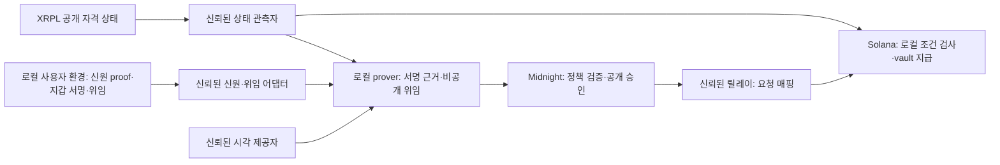
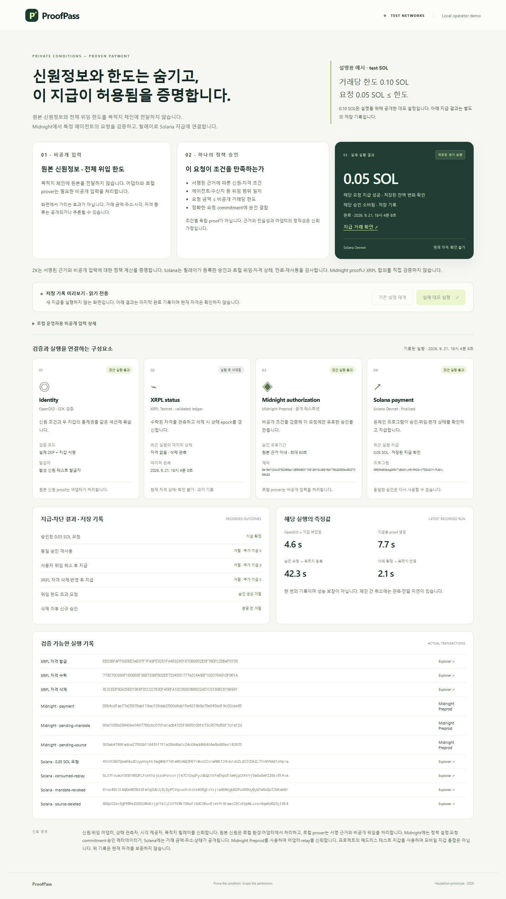

# ProofPass · 신원정보와 한도를 숨기고, 이 지급이 허용됨을 증명합니다

원본 신원정보와 전체 위임 한도를 **목적지 체인에 전달하지 않고**, 특정 에이전트의 지급 요청이 자격·위임 조건을 만족함을 Midnight에서 증명합니다. 신뢰하는 릴레이가 그 결과를 전달하면 Solana 프로그램이 실행 조건을 검사하고 vault에서 지급합니다.

**영지식 증명 해커톤용 참조 구현**입니다. ZK는 신뢰된 서명 근거와 비공개 입력에 대한 정책 계산을 증명하며, 근거의 진실성이나 운영자의 정직성까지 보증하지 않습니다.

| 목적지에 전달하지 않는 원본 | Midnight에서 증명하는 조건 | 실제 공개·실행되는 결과 |
|---|---|---|
| 원본 신원정보·신원 proof | 신뢰된 어댑터가 서명한 신원 조건과 지갑·자격·위임의 주체 일치 | 정책 승인으로 조건 충족을 알 수 있음; 자격 종류도 공개·추론 가능 |
| 전체 위임 내용 중 거래당 한도·salt | 요청의 에이전트·수신자·자산 등이 위임 범위와 일치하고 요청 금액 ≤ 비공개 한도 | Solana의 해당 거래 금액·주소, 위임 commitment·버전 |
| 서명 근거와 비공개 witness 원문 | 시각·근거 유효기간과 정확한 요청의 결합 | Midnight의 요청 commitment·승인 메타데이터, Solana 지급·승인 소비 |

## 대표 사례: 한도는 전달하지 않고 0.05 SOL 지급

사용자가 지정한 에이전트에게 **거래당 0.10 SOL**까지 지급을 위임합니다. 에이전트의 **0.05 SOL** 요청이 한도와 다른 자격·위임 조건을 함께 만족하면 하나의 정책 승인이 생성됩니다. **0.10 SOL은 설명을 위해 공개한 데모 설정**입니다. 프라이버시 목표는 목적지에 사용자의 전체 한도 원문을 전달하지 않는 것이며, 누적 예산을 증명하는 기능은 아닙니다.

2026-09-21 저장 실행은 vault에서 **50,000,000 lamports 지급과 승인 소비**를 기록합니다. 같은 승인 재사용은 거절됐고, 별도로 준비한 미사용 승인도 위임 취소 또는 자격 삭제가 목적지에 반영된 뒤 만료 전에 거절됐습니다. 세 거절 거래 모두 추가 지급은 0입니다. 0.15 SOL 한도 초과 요청은 승인 생성 단계에서 거절됐으며 온체인 실패 proof는 없습니다.

## 확인 가능한 실제 실행 증거

[전체 실행·잔액 변화·거절 코드](evidence/preprod/live-flow.json) · [동일 지급의 대시보드 실행 기록](evidence/preprod/dashboard-run.json) · [0.05 SOL 지급 거래](https://explorer.solana.com/tx/4SnYCGG7QwaR4sdCcypVoytk3agMHbY7dteMSoNQ3P67iMxnZ2xrmRMtf24xbruhZLd2ZXDAZL7TvGV9A61oVpia?cluster=devnet)

기록의 흐름 완료 시각은 **2026-09-21 09:04:08 UTC**입니다. 실제 OpenDID SDK·XRPL Testnet·Midnight Preprod·Solana Devnet을 사용했고 신원 발급자는 합성 신원의 테스트 발급자입니다. 이는 과거 실행 증거이며 현재 자격이나 지금 생성한 proof를 뜻하지 않습니다. 아래 측정값과 증거는 해당 실행의 기록으로 유지합니다.

## ZK의 정책 검증과 목적지의 실행 제어

| 역할 | 코드에서 확인하는 범위 |
|---|---|
| **Midnight ZK** | 신원·바인딩·자격·위임·시각 근거의 서명, 주체와 목적지 일치, 에이전트·수신자·금액 한도, 유효기간을 하나의 정책으로 검증. 요청 commitment를 키로 승인 기록. [회로](midnight/contract/src/policy.compact) |
| **Solana 프로그램** | 등록된 승인과 정확한 요청 hash 일치, 에이전트 서명·수신자, 현재 로컬 위임·자격의 활성 상태와 버전, 만료, 미소비 여부를 검사한 뒤 해당 vault 지급과 승인 소비. [목적지 코드](solana/programs/authorization/src/lib.rs) |
| **신뢰하는 운영자 구성요소** | 신원·위임 어댑터, XRPL 상태 관측자, 시각 제공자, 목적지 릴레이. 어댑터는 등록된 위임도 대조하고 릴레이는 Midnight commitment를 정확한 요청에 매핑. [위임 대조](src/midnight/mandate-adapter.mjs) · [전달 경로](midnight/contract/src/live-flow.mjs) |

**Solana는 Midnight proof나 XRPL 합의를 직접 검증하지 않습니다.** 릴레이가 등록한 승인과 관측자가 등록한 상태를 검사합니다. 자격 취소의 반영에는 관측·전달 지연이 있고, 유효 근거가 없으면 지급을 중단합니다. 원본 근거와 승인 lease는 최대 60초입니다. 재사용·취소 후 지급 차단을 모두 ZK 자체의 기능으로 주장하지 않습니다.

## 정보 흐름과 신뢰 경계



| 정보 | 처리·공개 범위 |
|---|---|
| 원본 신원정보·OpenDID proof | 로컬 환경과 신원 어댑터에서 처리. Midnight 회로는 원본 대신 서명된 신원 조건 근거를 받음 |
| 자격 조건 충족 여부 | 정책 승인에서 추론 가능. Midnight 공개 설정에 발급자·자격 종류가 있고 XRPL의 Credential과 삭제도 공개 |
| 전체 거래당 위임 한도 | 로컬 위임 어댑터·prover가 처리. 목적지에는 salted mandate commitment를 등록. 로컬 운영자 화면·녹화에서는 데모 한도가 보일 수 있음 |
| 해당 거래 금액·수신자 | prover·릴레이가 처리하며 Solana 거래에 공개. 소유자·에이전트·vault 주소도 공개 |
| 요청 commitment·승인 메타데이터 | Midnight 공개 상태: 목적지·프로그램, 위임 commitment·epoch, source handle·epoch, 만료. Solana에는 요청 hash·Midnight 참조·소비 상태도 기록 |
| 거래 시각·상태 변경 | 체인에 공개되며 활동·주소를 연관시킬 수 있음. 익명성이나 거래 비연결성을 보장하지 않음 |

중앙 서버도 개인정보를 비공개로 처리할 수 있습니다. 중앙 검증에서는 서버가 조건을 확인했다는 판단을 신뢰합니다. ProofPass는 **신뢰된 서명 근거와 비공개 입력에 대해 정해진 정책 계산의 유효성**을 Midnight에서 증명하고, 릴레이와 Solana의 로컬 검사로 적용합니다. 모든 신뢰를 제거하는 구조는 아닙니다.

Midnight Preprod 계약: `6e16efc04cd792368ac1d858d63f109126fdc48915af76b22353e45b27056b29` · [배포 기록](evidence/preprod/midnight-live-deployment.json)

Solana Devnet 프로그램: [3983maEGpsg2M5tTqBqMtLm5rRmZsYKTDDUZAnrPuBAJ](https://explorer.solana.com/address/3983maEGpsg2M5tTqBqMtLm5rRmZsYKTDDUZAnrPuBAJ?cluster=devnet)

## 지갑과 비공개 데이터

현재 지갑은 **Wallet SDK 기반 헤드리스 지갑**입니다. 프로젝트의 로컬 환경이 테스트 키를 보관하고 코드가 서명·제출합니다. Midnight에서는 faucet으로 받은 **unshielded NIGHT**를 등록해 **DUST** 수수료를 마련합니다. 브라우저 지갑 연결과 모바일 지갑 통합은 아직 구현하지 않았습니다.

원본 신원 proof, 비밀키, 비공개 witness, 위임 내용과 거래 의도는 `.local` 및 WSL 비공개 디렉터리에 저장합니다. 로컬 지갑과 Preprod 지갑의 키·스냅샷·배포·거래 기록은 분리됩니다. 공개 저장소에는 검증 결과와 공개 거래 참조를 남깁니다.

## 데모 실행

**새 지급 없이 화면 확인:** `node scripts/preview-demo.mjs`를 실행하고 [읽기 전용 미리보기](http://127.0.0.1:4175)를 엽니다. 저장된 Preprod 기록을 표시하며 실행·재개 버튼은 비활성입니다. [운영·검증 안내](docs/DEMO-RUNBOOK.md)

현재 통합 실행 환경은 **Windows + Ubuntu WSL2**입니다. Node 22.23.2, 고정 OpenDID·Midnight 도구, 로컬 proof server, 프로젝트 테스트 지갑이 필요합니다. 신규 환경 준비는 [호환성 기록](COMPATIBILITY.md), [Midnight 설치 안내](midnight/README.md), [Preprod 운영 안내](docs/MIDNIGHT-PREPROD.md)를 따릅니다. 키와 도구 디렉터리는 Git에 포함되지 않습니다.

준비된 환경에서 PowerShell로 실행합니다.

```powershell
$env:PROOFPASS_MIDNIGHT_NETWORK = 'preprod'
& './.tools/node-v22.23.2-win-x64/node.exe' scripts/demo.mjs
```

[http://127.0.0.1:4174](http://127.0.0.1:4174)에서 운영 화면을 엽니다.

- **실제 데모 실행:** 지갑을 복원·동기화한 뒤 새 신원 바인딩과 실제 테스트넷 거래를 수행합니다. 0.05 test SOL을 지급하며 마지막에 XRPL 자격을 삭제합니다.
- **기존 실행 재개:** 같은 실행의 보존된 의도와 영수증을 대조합니다. 완료된 실행의 재개는 추가 지급을 만들지 않습니다. 미완료 단계의 신원·승인이 만료됐다면 새 지급을 진행하지 않고 대조가 필요합니다.
- 화면의 성공 표시는 **마지막 완료 기록**입니다. 현재 자격이 유효하다는 보증은 아닙니다.

첫 DUST 지갑 동기화는 공개망 이력을 읽어 상당한 시간이 걸릴 수 있습니다. 저장된 상태 복원에도 몇 분이 걸릴 수 있으며, 아래 실측 시간은 지갑 준비를 제외합니다. faucet 사람 확인은 직접 수행하고 시드·비밀번호를 공유하지 않습니다.

[](artifacts/zk-demo-ui/preprod/desktop.png)

[모바일 캡처](artifacts/zk-demo-ui/preprod/mobile.png) · [이번 UI 브라우저 검사](artifacts/zk-demo-ui/preprod/browser-check.json). 과거 체인 실행·측정 증거는 아래 원래 경로에 보존합니다.

## 실제 측정값과 증거

아래는 **한 번의 검증 실행**에서 측정한 값으로, 성능 보장이나 평균값이 아닙니다. Solana 공용 RPC의 429 재시도도 발생했습니다.

| 항목 | 측정값 |
|---|---:|
| OpenDID + 지갑 바인딩 | 4.6초 |
| 지급용 계약 proof 생성 | 7.7초 |
| 지급 승인 요청 → Solana 승인 등록 | 42.3초 |
| Solana 지급 실행·확인 | 1.7초 |
| XRPL 삭제 확정 → 목적지 상태 반영 | 2.1초 |
| 전체 검증 흐름, 지갑 준비 제외 | 3분 42초 |

- [전체 공개망 실행](evidence/preprod/live-flow.json): 지급, 재사용·취소 차단, 잔액 대조, 시간
- [대시보드 실행 기록](evidence/preprod/dashboard-run.json): 같은 실행의 API·지급 참조
- [만료 후 재개 검증](evidence/preprod/live-recovery.json): Solana 영수증 18개·Midnight 승인 3개 대조, 추가 지급 0
- [증거·소스 해시 목록](evidence/preprod/demo-run.json): 코드 기준점, 검증 범위, 파일 해시
- [배포 영수증](evidence/preprod/midnight-live-deployment.json), [공식망 RPC 확인](evidence/preprod/network-probe.json)
- [PC·모바일 브라우저 검사](evidence/preprod/browser/browser-check.json), [모바일 화면](evidence/preprod/browser/mobile.png)

해당 과거 실행에서 Node 회귀 테스트 **45개**와 두 화면 크기의 브라우저 검사를 통과했습니다. 회로·Solana 프로그램의 기존 로컬 검증은 [Gate 1 기록](docs/GATE1-STATUS.md)에 있습니다.

```powershell
& './.tools/node-v22.23.2-win-x64/node.exe' --test test/*.test.mjs
$env:PROOFPASS_MIDNIGHT_NETWORK = 'preprod'
& './.tools/node-v22.23.2-win-x64/node.exe' scripts/check-demo-browser.mjs
```

## 범위와 신뢰 가정

어댑터·시각 제공자·상태 관측자·relay를 신뢰합니다. **Solana는 Midnight proof나 XRPL 합의를 직접 검증하지 않습니다.** relay가 등록한 승인과 관측자가 등록한 상태를 검사합니다. 로컬 prover는 비공개 witness를 처리하며, 실제 지급 주소·금액·시각은 공개될 수 있습니다. 체인 간 취소에는 반영 지연이 있습니다.

통제 범위는 **해당 프로그램의 vault 지급 경로**입니다. 모든 지갑 송금이나 여러 체인의 공통 누적 예산을 통제하지 않습니다. 에이전트 역할의 키로 요청·서명하는 데모이며 자율 AI의 구매 판단이나 사기 탐지를 검증한 것은 아닙니다. Solana 프로그램의 업그레이드 권한은 프로젝트 운영자에게 남아 있습니다. 합성 신원과 프로젝트 테스트 지갑을 사용하는 해커톤 프로토타입이며, 운영용 지갑이나 전체 SDK에 대한 보안 감사 결과를 제공하지 않습니다.

## 기존 기술과의 관계 · 미구현 방향

위임·선택적 공개·ZK 자격 검증·일회용 승인 자체의 발명을 주장하지 않습니다. 이 저장소의 기여는 비공개 정책 승인과 실제 목적지 지급·차단을 연결한 검토 가능한 구현과 실행 기록입니다. T54·AP2·Verifiable Intent·Privado ID와의 호환성, 비용·보안 우위는 검증하지 않았습니다. 기존 기술의 관계는 [2026-09-21 비교 검토](docs/POSITIONING.md)에 보존합니다.

**다음 설계 방향 — 기업에서 Agent까지 이어지는 권한:** “이 Agent는 어떤 법인을 대신해, 누구에게 권한을 받아, 어디까지 행동할 수 있는가?”를 검증하는 구조를 설계하고 있습니다. [기업 권한 설계 초안](docs/superpowers/specs/2026-09-21-corporate-authority-design.md)은 조직 → 담당자 → Agent의 재위임과 상위 권한 회수를 다룹니다. 아래 기존 실행 결과에는 아직 이 기능이 포함되지 않습니다.

기업용 조직 승인·재위임, 새로운 결제 기능은 이번 ZK 데모의 검증 범위가 아닙니다.

## 기존 로컬 데모와 코드

`main`의 최초 기준점은 [`083a20a`](https://github.com/tnwjd023-boop/Proof-Pass/commit/083a20a)입니다. `evidence/gate1`과 [기존 발표 영상](evidence/demo/watch.html)은 **Midnight 로컬 네트워크**에서 실행한 기록입니다. 영상은 같은 실행의 1.4배속 재생이며 Preprod 실행 영상으로 제시하지 않습니다. 공개망 전환은 `feat/midnight-preprod` 브랜치에 보존합니다.

- `src/binding`: OpenDID 세션·지갑 통제권 검증
- `midnight/contract`: 비공개 정책 회로와 실행 어댑터
- `solana`: 목적지 위임·상태·지급 프로그램
- `scripts/gate1`: 실제 체인 실행과 복구
- `web`, `src/demo-server.mjs`: 로컬 운영 화면
- `evidence/preprod`: 공개망 실행 증거
