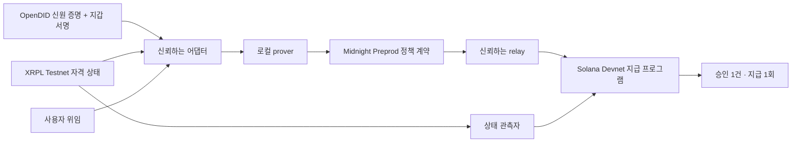

# ProofPass

**에이전트에게 결제를 맡겨도, 자격이 유효하고 내가 허용한 범위 안에서만 돈이 나가도록.**

ProofPass는 **사용자의 신원·서비스 자격과 에이전트의 지급 권한을 연결하는 해커톤 프로토타입**입니다. 기존 신원 근거를 활용하고, 현재 유효한 자격과 사용자가 정한 위임 조건을 확인해 특정 거래를 한 번만 실행하도록 합니다. 이 과정에서 원본 신원정보와 전체 위임 한도를 공개 체인에 올리지 않는 것을 목표로 합니다.

## 문제 정의: 자격 확인과 지급 허용 사이의 빈틈

사용자가 신원 확인을 마쳤고 서비스 회원 자격도 갖고 있다고 해봅시다. 이제 에이전트에게 다른 체인에서 결제를 맡기려면, 결제 서비스는 **“이 사용자는 누구인가?”에 더해 “이 에이전트가 지금 이 돈을 보내도 되는가?”**를 판단해야 합니다.

| 결제 전에 답해야 할 질문 | 확인하지 않으면 생기는 문제 |
|---|---|
| 신원·자격의 발급자를 믿을 수 있고, 해당 자격을 우리 서비스에서도 인정하는가? | 증명서가 있어도 서비스 이용 조건을 충족한다는 뜻은 아닙니다. |
| 신원 증명과 서로 다른 체인의 지갑이 같은 사용자에게 연결되는가? | 다른 사람의 자격을 지급 권한에 연결할 수 있습니다. |
| 그 자격이 지금도 유효한가? | 이미 회수된 자격으로 거래할 수 있습니다. |
| 사용자가 이 에이전트·수취인·금액·기간을 허용했는가? | 자격 있는 사용자의 요청이어도 위임 범위를 벗어날 수 있습니다. |
| 취소된 위임이나 이미 사용한 승인인가? | 취소 후 지급하거나 같은 승인으로 두 번 지급할 수 있습니다. |

지갑 서명은 서명한 키와 메시지를 확인하는 근거입니다. 외부 서비스의 최신 자격이나 별도로 정한 위임 조건까지 확인하려면 추가 검증이 필요합니다. 화면이나 API에서만 검사한다면, 지급 프로그램을 직접 호출하는 경로에서도 같은 제한이 적용되는지 확인해야 합니다.

**ProofPass가 풀려는 문제는, 여러 시스템에 흩어진 신원·자격·위임을 실제 지급 시점의 실행 조건으로 연결하는 일입니다.** 사업자는 이를 서비스마다 연동해야 하고, 사용자는 그 과정에서 개인정보 재제출이나 반복 승인을 요구받을 수 있습니다. 체인이 바뀌면 반드시 신원 확인을 다시 해야 한다는 뜻은 아닙니다. 기존 근거를 어떤 조건으로 신뢰하고 사용할지가 핵심입니다.

## 예를 들면: 회원의 결제를 대신하는 에이전트

다음은 제품이 겨냥하는 사용 시나리오이며, 실제 고객 도입 사례는 아닙니다.

1. 사용자는 신원 확인을 거쳐 서비스의 회원 자격을 받습니다. 이 서비스는 XRPL에서 자격을 관리하고, Solana에서 결제를 제공합니다.
2. 사용자는 에이전트에게 **“정해진 기간 동안, 지정한 수취인에게, 거래당 최대 0.10 SOL까지”** 지급을 맡깁니다.
3. 에이전트가 0.05 SOL 지급을 요청하면, ProofPass는 신원 조건·현재 자격·위임 범위를 함께 확인해 **그 거래에만 사용할 승인**을 만듭니다.
4. Solana 지급 프로그램은 승인과 상태를 확인하고 한 번 지급합니다. 같은 승인을 다시 사용하거나 위임을 취소한 뒤 지급하려 하면 거절합니다.
5. 회원 자격을 회수하면, 그 변경이 목적지에 반영된 뒤에는 지급을 거절합니다. 체인 간 반영은 즉시 일어나지 않으며, 최신 상태를 확인할 수 있는 유효기간이 지나도 지급을 중단합니다.

**재사용하는 것은 신원 근거와 정책입니다. 지급 승인은 거래마다 새로 만들고 한 번만 사용합니다.**

## 누구에게 어떤 가치가 있나

첫 고객 가설은 **이미 이용 자격을 관리하면서 여러 체인의 결제·에이전트 기능을 제공하려는 서비스 사업자**입니다.

- **사용자:** 원본 신원정보를 공개하지 않으면서, 지급을 맡길 대상·수취인·기간·한도를 정하고 위임을 취소할 수 있습니다.
- **서비스 사업자:** 신원 검증부터 자격 변경, 위임, 지급까지 이어지는 연동을 재사용하고, 어떤 근거로 거래를 허용하거나 거절했는지 확인할 수 있습니다.
- **지급을 실행하는 서비스:** 전체 신원정보와 위임 한도를 넘겨받지 않고도, 해당 거래의 승인과 실행에 필요한 상태를 확인하는 구조를 사용할 수 있습니다.

이는 제품이 지향하는 가치입니다. **연동 비용 감소, 고객 수요, 지불 의사는 아직 검증하지 않았습니다.** 현재 검증한 것은 아래 테스트넷 환경에서 정상 지급과 재사용·취소·자격 삭제·한도 초과 차단이 동작한다는 점입니다.

## 왜 OpenDID · XRPL · Midnight · Solana인가

이 데모는 **신원 근거가 있는 곳, 자격을 관리하는 곳, 돈을 보내는 곳이 서로 다른 상황**을 구현합니다. OpenDID는 신원 증명, XRPL은 서비스 자격의 상태, Solana는 실제 지급을 담당합니다.

Midnight는 이 사이에서 **신원 조건 + 현재 자격 + 비공개 위임 조건 + 요청 거래**를 결합해 정책을 증명합니다. 목적지에 원본 신원정보와 전체 위임 한도를 공개하지 않으면서 특정 거래의 승인을 만드는 역할입니다. 입력을 검증하는 어댑터와 승인을 전달하는 relay에는 여전히 신뢰가 필요하며, 이 데모가 그 신뢰를 없애지는 않습니다.

한 사업자의 서버에서 모든 조건을 처리해도 되는 서비스라면 중앙 API가 더 단순할 수 있습니다. ProofPass의 가치는 **여러 시스템의 자격과 위임을 결합하고, 비공개 조건을 검증하며, 실제 체인 지급까지 제한해야 하는 상황**에서 평가해야 합니다. 모든 서비스에 네 구성요소가 필요한 것은 아닙니다.

## 무엇을 검증했나

**실제 OpenDID SDK → XRPL Testnet → Midnight Preprod → Solana Devnet 전체 실행을 통과했습니다.** 아래 결과는 2026-09-21의 실제 테스트넷 거래 기록입니다. 신원 발급자는 합성 신원을 사용하는 테스트 발급자입니다.

[실행 영수증](evidence/preprod/live-flow.json) · [Midnight 배포](evidence/preprod/midnight-live-deployment.json) · [공개망 운영 안내](docs/MIDNIGHT-PREPROD.md)

| 상황 | 실제 결과 |
|---|---|
| 유효한 자격과 사용자 위임으로 0.05 SOL 요청 | 프로그램 소유 vault에서 지급, 승인 소비 |
| 같은 승인 재사용 | 거절, 추가 지급 0 |
| 사용자 위임 취소 후 지급 | 거절, 잔액 변화 없음 |
| XRPL 자격 삭제·목적지 반영 후 지급 | 거절, 잔액 변화 없음 |
| 자격 삭제 후 새로운 승인 요청 | 증명 생성 전 거절 |
| 거래당 0.10 SOL 위임으로 0.15 SOL 요청 | 승인 생성 단계에서 거절, 온체인 제출 없음 |

취소 검사는 승인 자체가 아직 만료되지 않은 시점에 수행했습니다. 한도 초과 검사는 승인 생성 거절이며, 별도의 온체인 `FAIL proof`가 생성된 것은 아닙니다. 각 결과와 잔액 대조는 [전체 실행 기록](evidence/preprod/live-flow.json)에 있습니다.

## 어떻게 연결되나



OpenDID 증명을 세션 nonce에 묶고, XRPL·Solana 지갑의 서명을 확인합니다. 어댑터는 자격·위임·시각 근거를 검증해 Midnight 증명의 입력을 준비합니다. relay는 확정된 승인을 목적지에 등록하고, Solana 프로그램은 실행 시점의 위임과 자격 상태를 다시 확인합니다. 원본 근거와 승인 유효기간은 **최대 60초**이며, 공개망 지연 때문에 이를 넘기면 지급을 중단합니다.

| 구성 | 네트워크·역할 |
|---|---|
| OpenDID | 실제 SDK 암호 검증, 합성 신원 테스트 발급자 |
| XRPL | Testnet의 CredentialCreate → Accept → Delete |
| Midnight | **Preprod**의 정책 증명·승인, 로컬 proof server 사용 |
| Solana | **Devnet**의 위임·상태·일회용 승인 검사와 지급 |

Midnight 계약: `6e16efc04cd792368ac1d858d63f109126fdc48915af76b22353e45b27056b29`

Solana 프로그램: [`3983maEGpsg2M5tTqBqMtLm5rRmZsYKTDDUZAnrPuBAJ`](https://explorer.solana.com/address/3983maEGpsg2M5tTqBqMtLm5rRmZsYKTDDUZAnrPuBAJ?cluster=devnet)

Midnight 배포는 Preprod 블록 **2,644,713**에서 확인했습니다. 배포 거래 ID·genesis와 전체 흐름의 거래 참조는 위 영수증에 보존합니다.

## 지갑과 비공개 데이터

현재 지갑은 **Wallet SDK 기반 헤드리스 지갑**입니다. 프로젝트의 로컬 환경이 테스트 키를 보관하고 코드가 서명·제출합니다. Midnight에서는 faucet으로 받은 **unshielded NIGHT**를 등록해 **DUST** 수수료를 마련합니다. 브라우저 지갑 연결과 모바일 지갑 통합은 아직 구현하지 않았습니다.

원본 신원 proof, 비밀키, 비공개 witness, 위임 내용과 거래 의도는 `.local` 및 WSL 비공개 디렉터리에 저장합니다. 로컬 지갑과 Preprod 지갑의 키·스냅샷·배포·거래 기록은 분리됩니다. 공개 저장소에는 검증 결과와 공개 거래 참조를 남깁니다.

## 데모 실행

현재 통합 실행 환경은 **Windows + Ubuntu WSL2**입니다. Node 22.23.2, 고정 OpenDID·Midnight 도구, 로컬 proof server, 프로젝트 테스트 지갑이 필요합니다. 신규 환경 준비는 [호환성 기록](COMPATIBILITY.md), [Midnight 설치 안내](midnight/README.md), [Preprod 운영 안내](docs/MIDNIGHT-PREPROD.md)를 따릅니다. 키와 도구 디렉터리는 Git에 포함되지 않습니다.

준비된 환경에서 PowerShell로 실행합니다.

```powershell
$env:PROOFPASS_MIDNIGHT_NETWORK = 'preprod'
& './.tools/node-v22.23.2-win-x64/node.exe' scripts/demo.mjs
```

[http://127.0.0.1:4174](http://127.0.0.1:4174)에서 운영 화면을 엽니다.

- **실제 데모 실행:** 지갑을 복원·동기화한 뒤 새 신원 바인딩과 실제 테스트넷 거래를 수행합니다. 0.05 test SOL을 지급하며 마지막에 XRPL 자격을 삭제합니다.
- **기존 실행 재개:** 같은 실행의 보존된 의도와 영수증을 대조합니다. 완료된 실행의 재개는 추가 지급을 만들지 않습니다. 미완료 단계의 신원·승인이 만료됐다면 새 지급을 진행하지 않고 대조가 필요합니다.
- 화면의 성공 표시는 **마지막 완료 기록**입니다. 현재 자격이 유효하다는 보증은 아닙니다.

첫 DUST 지갑 동기화는 공개망 이력을 읽어 상당한 시간이 걸릴 수 있습니다. 저장된 상태 복원에도 몇 분이 걸릴 수 있으며, 아래 실측 시간은 지갑 준비를 제외합니다. faucet 사람 확인은 직접 수행하고 시드·비밀번호를 공유하지 않습니다.

[](evidence/preprod/browser/desktop.png)

## 실제 측정값과 증거

아래는 **한 번의 검증 실행**에서 측정한 값으로, 성능 보장이나 평균값이 아닙니다. Solana 공용 RPC의 429 재시도도 발생했습니다.

| 항목 | 측정값 |
|---|---:|
| OpenDID + 지갑 바인딩 | 4.6초 |
| 지급용 계약 proof 생성 | 7.7초 |
| 지급 승인 요청 → Solana 승인 등록 | 42.3초 |
| Solana 지급 실행·확인 | 1.7초 |
| XRPL 삭제 확정 → 목적지 상태 반영 | 2.1초 |
| 전체 검증 흐름, 지갑 준비 제외 | 3분 42초 |

- [전체 공개망 실행](evidence/preprod/live-flow.json): 지급, 재사용·취소 차단, 잔액 대조, 시간
- [대시보드 실행 기록](evidence/preprod/dashboard-run.json): 같은 실행의 API·지급 참조
- [만료 후 재개 검증](evidence/preprod/live-recovery.json): Solana 영수증 18개·Midnight 승인 3개 대조, 추가 지급 0
- [증거·소스 해시 목록](evidence/preprod/demo-run.json): 코드 기준점, 검증 범위, 파일 해시
- [배포 영수증](evidence/preprod/midnight-live-deployment.json), [공식망 RPC 확인](evidence/preprod/network-probe.json)
- [PC·모바일 브라우저 검사](evidence/preprod/browser/browser-check.json), [모바일 화면](evidence/preprod/browser/mobile.png)

Node 회귀 테스트 **45개**와 두 화면 크기의 브라우저 검사를 통과했습니다. 회로·Solana 프로그램의 기존 로컬 검증은 [Gate 1 기록](docs/GATE1-STATUS.md)에 있습니다.

```powershell
& './.tools/node-v22.23.2-win-x64/node.exe' --test test/*.test.mjs
$env:PROOFPASS_MIDNIGHT_NETWORK = 'preprod'
& './.tools/node-v22.23.2-win-x64/node.exe' scripts/check-demo-browser.mjs
```

## 범위와 신뢰 가정

어댑터·시각 제공자·상태 관측자·relay를 신뢰합니다. 로컬 prover는 비공개 witness를 처리합니다. 공개 거래 참조와 시각으로 활동이 연관될 수 있고, 체인 간 취소에는 반영 지연이 있습니다. Solana 프로그램의 업그레이드 권한은 프로젝트 운영자에게 남아 있습니다. 합성 신원과 프로젝트 테스트 지갑을 사용하는 해커톤 프로토타입이며, 운영용 지갑이나 전체 SDK에 대한 보안 감사 결과를 제공하지 않습니다.

## 기존 로컬 데모와 코드

`main`의 최초 기준점은 [`083a20a`](https://github.com/tnwjd023-boop/Proof-Pass/commit/083a20a)입니다. `evidence/gate1`과 [기존 발표 영상](evidence/demo/watch.html)은 **Midnight 로컬 네트워크**에서 실행한 기록입니다. 영상은 같은 실행의 1.4배속 재생이며 Preprod 실행 영상으로 제시하지 않습니다. 공개망 전환은 `feat/midnight-preprod` 브랜치에 보존합니다.

- `src/binding`: OpenDID 세션·지갑 통제권 검증
- `midnight/contract`: 비공개 정책 회로와 실행 어댑터
- `solana`: 목적지 위임·상태·지급 프로그램
- `scripts/gate1`: 실제 체인 실행과 복구
- `web`, `src/demo-server.mjs`: 로컬 운영 화면
- `evidence/preprod`: 공개망 실행 증거
