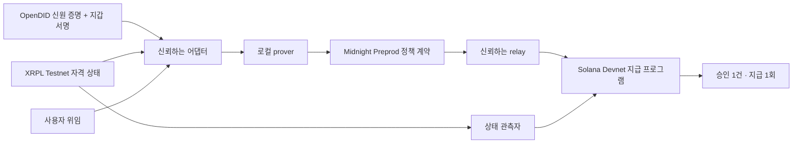

# ProofPass

**자격은 비공개로. 에이전트의 지급 권한은 한 건의 거래로.**

ProofPass는 신원 조건, 지갑 통제권, 현재 자격, 사용자의 위임을 함께 검증해 에이전트의 지급을 승인하는 해커톤 프로토타입입니다. Midnight에서 비공개 조건을 증명하고, Solana 프로그램이 수취인·금액·만료·취소·재사용 여부를 확인한 뒤 **0.05 test SOL**을 지급합니다.

**실제 OpenDID SDK → XRPL Testnet → Midnight Preprod → Solana Devnet 전체 실행을 통과했습니다.** 아래 결과는 2026-09-21의 실제 테스트넷 거래 기록입니다. 신원 발급자는 합성 신원을 사용하는 테스트 발급자입니다.

[실행 영수증](evidence/preprod/live-flow.json) · [Midnight 배포](evidence/preprod/midnight-live-deployment.json) · [공개망 운영 안내](docs/MIDNIGHT-PREPROD.md)

## 무엇을 검증했나

| 상황 | 실제 결과 |
|---|---|
| 유효한 자격과 사용자 위임으로 0.05 SOL 요청 | 프로그램 소유 vault에서 지급, 승인 소비 |
| 같은 승인 재사용 | 거절, 추가 지급 0 |
| 사용자 위임 취소 후 지급 | 거절, 잔액 변화 없음 |
| XRPL 자격 삭제·목적지 반영 후 지급 | 거절, 잔액 변화 없음 |
| 자격 삭제 후 새로운 승인 요청 | 증명 생성 전 거절 |
| 거래당 0.10 SOL 위임으로 0.15 SOL 요청 | 승인 생성 단계에서 거절, 온체인 제출 없음 |

취소 검사는 승인 자체가 아직 만료되지 않은 시점에 수행했습니다. 한도 초과 검사는 승인 생성 거절이며, 별도의 온체인 `FAIL proof`가 생성된 것은 아닙니다. 각 결과와 잔액 대조는 [전체 실행 기록](evidence/preprod/live-flow.json)에 있습니다.

## 어떻게 연결되나



OpenDID 증명을 세션 nonce에 묶고, XRPL·Solana 지갑의 서명을 확인합니다. 어댑터는 자격·위임·시각 근거를 검증해 Midnight 증명의 입력을 준비합니다. relay는 확정된 승인을 목적지에 등록하고, Solana 프로그램은 실행 시점의 위임과 자격 상태를 다시 확인합니다. 원본 근거와 승인 유효기간은 **최대 60초**이며, 공개망 지연 때문에 이를 넘기면 지급을 중단합니다.

| 구성 | 네트워크·역할 |
|---|---|
| OpenDID | 실제 SDK 암호 검증, 합성 신원 테스트 발급자 |
| XRPL | Testnet의 CredentialCreate → Accept → Delete |
| Midnight | **Preprod**의 정책 증명·승인, 로컬 proof server 사용 |
| Solana | **Devnet**의 위임·상태·일회용 승인 검사와 지급 |

Midnight 계약: `6e16efc04cd792368ac1d858d63f109126fdc48915af76b22353e45b27056b29`

Solana 프로그램: [`3983maEGpsg2M5tTqBqMtLm5rRmZsYKTDDUZAnrPuBAJ`](https://explorer.solana.com/address/3983maEGpsg2M5tTqBqMtLm5rRmZsYKTDDUZAnrPuBAJ?cluster=devnet)

Midnight 배포는 Preprod 블록 **2,644,713**에서 확인했습니다. 배포 거래 ID·genesis와 전체 흐름의 거래 참조는 위 영수증에 보존합니다.

## 지갑과 비공개 데이터

현재 지갑은 **Wallet SDK 기반 헤드리스 지갑**입니다. 프로젝트의 로컬 환경이 테스트 키를 보관하고 코드가 서명·제출합니다. Midnight에서는 faucet으로 받은 **unshielded NIGHT**를 등록해 **DUST** 수수료를 마련합니다. 브라우저 지갑 연결과 모바일 지갑 통합은 아직 구현하지 않았습니다.

원본 신원 proof, 비밀키, 비공개 witness, 위임 내용과 거래 의도는 `.local` 및 WSL 비공개 디렉터리에 저장합니다. 로컬 지갑과 Preprod 지갑의 키·스냅샷·배포·거래 기록은 분리됩니다. 공개 저장소에는 검증 결과와 공개 거래 참조를 남깁니다.

## 데모 실행

현재 통합 실행 환경은 **Windows + Ubuntu WSL2**입니다. Node 22.23.2, 고정 OpenDID·Midnight 도구, 로컬 proof server, 프로젝트 테스트 지갑이 필요합니다. 신규 환경 준비는 [호환성 기록](COMPATIBILITY.md), [Midnight 설치 안내](midnight/README.md), [Preprod 운영 안내](docs/MIDNIGHT-PREPROD.md)를 따릅니다. 키와 도구 디렉터리는 Git에 포함되지 않습니다.

준비된 환경에서 PowerShell로 실행합니다.

```powershell
$env:PROOFPASS_MIDNIGHT_NETWORK = 'preprod'
& './.tools/node-v22.23.2-win-x64/node.exe' scripts/demo.mjs
```

[http://127.0.0.1:4174](http://127.0.0.1:4174)에서 운영 화면을 엽니다.

- **실제 데모 실행:** 지갑을 복원·동기화한 뒤 새 신원 바인딩과 실제 테스트넷 거래를 수행합니다. 0.05 test SOL을 지급하며 마지막에 XRPL 자격을 삭제합니다.
- **기존 실행 재개:** 같은 실행의 보존된 의도와 영수증을 대조합니다. 완료된 실행의 재개는 추가 지급을 만들지 않습니다. 미완료 단계의 신원·승인이 만료됐다면 새 지급을 진행하지 않고 대조가 필요합니다.
- 화면의 성공 표시는 **마지막 완료 기록**입니다. 현재 자격이 유효하다는 보증은 아닙니다.

첫 DUST 지갑 동기화는 공개망 이력을 읽어 상당한 시간이 걸릴 수 있습니다. 저장된 상태 복원에도 몇 분이 걸릴 수 있으며, 아래 실측 시간은 지갑 준비를 제외합니다. faucet 사람 확인은 직접 수행하고 시드·비밀번호를 공유하지 않습니다.

[](evidence/preprod/browser/desktop.png)

## 실제 측정값과 증거

아래는 **한 번의 검증 실행**에서 측정한 값으로, 성능 보장이나 평균값이 아닙니다. Solana 공용 RPC의 429 재시도도 발생했습니다.

| 항목 | 측정값 |
|---|---:|
| OpenDID + 지갑 바인딩 | 4.6초 |
| 지급용 계약 proof 생성 | 7.7초 |
| 지급 승인 요청 → Solana 승인 등록 | 42.3초 |
| Solana 지급 실행·확인 | 1.7초 |
| XRPL 삭제 확정 → 목적지 상태 반영 | 2.1초 |
| 전체 검증 흐름, 지갑 준비 제외 | 3분 42초 |

- [전체 공개망 실행](evidence/preprod/live-flow.json): 지급, 재사용·취소 차단, 잔액 대조, 시간
- [대시보드 실행 기록](evidence/preprod/dashboard-run.json): 같은 실행의 API·지급 참조
- [만료 후 재개 검증](evidence/preprod/live-recovery.json): Solana 영수증 18개·Midnight 승인 3개 대조, 추가 지급 0
- [증거·소스 해시 목록](evidence/preprod/demo-run.json): 코드 기준점, 검증 범위, 파일 해시
- [배포 영수증](evidence/preprod/midnight-live-deployment.json), [공식망 RPC 확인](evidence/preprod/network-probe.json)
- [PC·모바일 브라우저 검사](evidence/preprod/browser/browser-check.json), [모바일 화면](evidence/preprod/browser/mobile.png)

Node 회귀 테스트 **45개**와 두 화면 크기의 브라우저 검사를 통과했습니다. 회로·Solana 프로그램의 기존 로컬 검증은 [Gate 1 기록](docs/GATE1-STATUS.md)에 있습니다.

```powershell
& './.tools/node-v22.23.2-win-x64/node.exe' --test test/*.test.mjs
$env:PROOFPASS_MIDNIGHT_NETWORK = 'preprod'
& './.tools/node-v22.23.2-win-x64/node.exe' scripts/check-demo-browser.mjs
```

## 범위와 신뢰 가정

어댑터·시각 제공자·상태 관측자·relay를 신뢰합니다. 로컬 prover는 비공개 witness를 처리합니다. 공개 거래 참조와 시각으로 활동이 연관될 수 있고, 체인 간 취소에는 반영 지연이 있습니다. Solana 프로그램의 업그레이드 권한은 프로젝트 운영자에게 남아 있습니다. 합성 신원과 프로젝트 테스트 지갑을 사용하는 해커톤 프로토타입이며, 운영용 지갑이나 전체 SDK에 대한 보안 감사 결과를 제공하지 않습니다.

## 기존 로컬 데모와 코드

`main`의 최초 기준점은 [`083a20a`](https://github.com/tnwjd023-boop/Proof-Pass/commit/083a20a)입니다. `evidence/gate1`과 [기존 발표 영상](evidence/demo/watch.html)은 **Midnight 로컬 네트워크**에서 실행한 기록입니다. 영상은 같은 실행의 1.4배속 재생이며 Preprod 실행 영상으로 제시하지 않습니다. 공개망 전환은 `feat/midnight-preprod` 브랜치에 보존합니다.

- `src/binding`: OpenDID 세션·지갑 통제권 검증
- `midnight/contract`: 비공개 정책 회로와 실행 어댑터
- `solana`: 목적지 위임·상태·지급 프로그램
- `scripts/gate1`: 실제 체인 실행과 복구
- `web`, `src/demo-server.mjs`: 로컬 운영 화면
- `evidence/preprod`: 공개망 실행 증거
